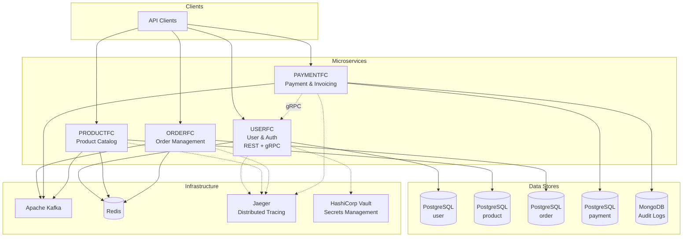
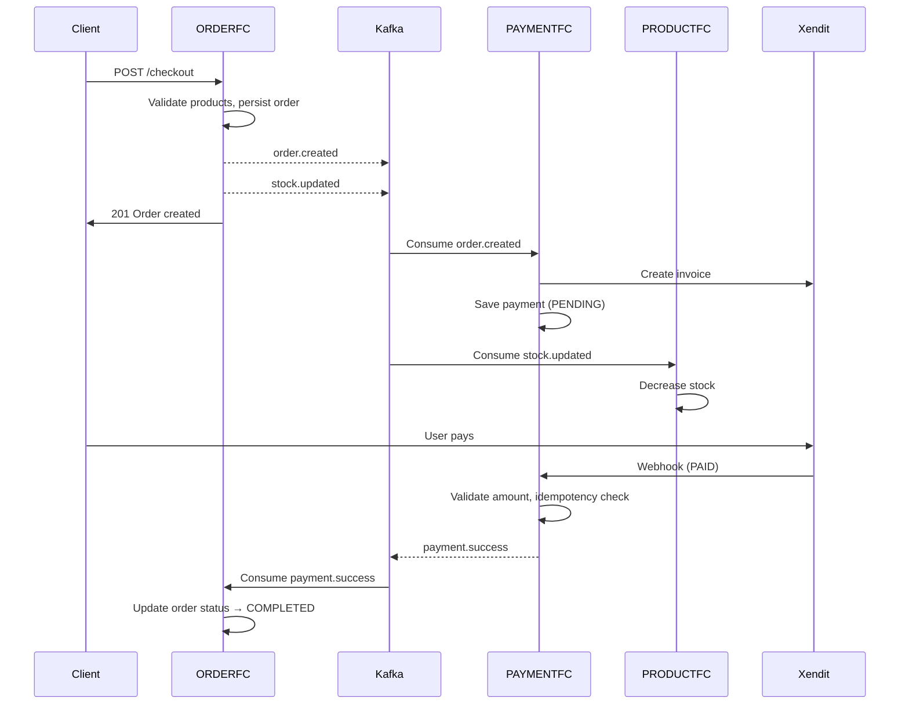
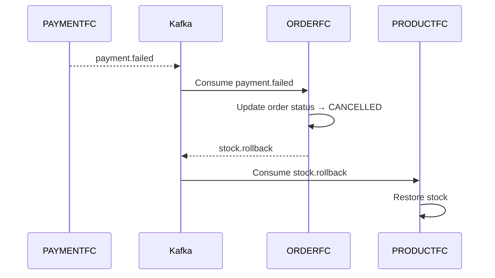

# Go Commerce

**Event-driven e-commerce platform built with Go and microservices architecture.**

A distributed system that handles user management, product catalog, order processing, and payment integration. Each domain runs as an independent service with its own database, communicating asynchronously via Apache Kafka and synchronously via gRPC where needed.

---

## Architecture Overview

The system follows **Microservices Architecture** with **Database per Service**. Each bounded context owns its data and exposes capabilities via REST APIs, gRPC, and domain events.



---

## Services

| Service       | HTTP Port | gRPC Port | Responsibility |
|--------------|-----------|-----------|----------------|
| **USERFC**    | 28080     | 50051     | User registration, authentication (JWT), user info via gRPC |
| **PRODUCTFC** | 28081     | —         | Product & category CRUD, inventory management, stock update/rollback via Kafka |
| **ORDERFC**   | 28082     | —         | Order creation, order history, publishes `order.created` & `stock.updated`, consumes `payment.success` & `payment.failed` |
| **PAYMENTFC** | 28083     | —         | Xendit invoice creation, webhook handling, batch processing, audit logging, publishes `payment.success` & `payment.failed` |

Each service is a **Go** application (Gin, GORM) with a layered structure:

```
Handler → Usecase → Service → Repository
```

---

## Event-Driven Flow

### Order → Payment → Stock (Happy Path)



### Payment Failure → Stock Rollback



### Kafka Topics

| Topic            | Producer    | Consumer(s)           | Purpose |
|-----------------|-------------|-----------------------|---------|
| `order.created`  | ORDERFC     | PAYMENTFC             | Trigger invoice creation |
| `stock.updated`  | ORDERFC     | PRODUCTFC             | Decrease product stock on order |
| `stock.rollback` | ORDERFC     | PRODUCTFC             | Restore product stock on payment failure |
| `payment.success`| PAYMENTFC   | ORDERFC               | Mark order as completed |
| `payment.failed` | PAYMENTFC   | ORDERFC               | Mark order as cancelled, trigger stock rollback |

---

## Inter-Service Communication

| From | To | Protocol | Purpose |
|------|----|----------|---------|
| PAYMENTFC | USERFC | **gRPC** | Fetch user email for invoice creation |
| ORDERFC | PRODUCTFC | **HTTP** | Validate product info & stock before checkout |
| All services | — | **Kafka** | Asynchronous event-driven integration |

---

## Technology Stack

| Layer              | Technology |
|-------------------|------------|
| Language          | Go 1.22+ |
| HTTP Framework    | Gin |
| ORM               | GORM |
| Inter-service RPC | gRPC + Protocol Buffers |
| Message Broker    | Apache Kafka (segmentio/kafka-go) |
| Cache             | Redis 7 |
| Database          | PostgreSQL 15 (one instance per service) |
| Audit Log         | MongoDB 7 (append-only event store) |
| Payment Gateway   | Xendit (invoicing & webhooks) |
| Distributed Tracing | Jaeger + OpenTelemetry (OTLP) |
| Secrets Management | HashiCorp Vault |
| Container         | Docker, Docker Compose |
| Kafka UI          | Kafdrop |

---

## Getting Started

### Prerequisites

- Docker & Docker Compose
- Go 1.22+ (for local development)

### 1. Clone

```bash
git clone <repository-url> go-commerce
cd go-commerce
git submodule update --init --recursive
```

### 2. Run locally (Docker Compose)

```bash
docker compose up -d
```

This starts:

| Component | Host Port | URL / Address |
|-----------|-----------|---------------|
| PostgreSQL (user) | 5433 | `localhost:5433` |
| PostgreSQL (product) | 5434 | `localhost:5434` |
| PostgreSQL (order) | 5435 | `localhost:5435` |
| PostgreSQL (payment) | 5436 | `localhost:5436` |
| MongoDB (audit logs) | 27017 | `localhost:27017` |
| Redis | 6379 | `localhost:6379` |
| Kafka | 29092 / 29093 | `localhost:29092` |
| Zookeeper | 22181 | `localhost:22181` |
| Kafdrop (Kafka UI) | 29000 | http://localhost:29000 |
| Vault | 8200 | http://localhost:8200 |
| Jaeger UI | 16686 | http://localhost:16686 |
| USERFC | 28080 | http://localhost:28080 |
| USERFC gRPC | 50051 | `localhost:50051` |
| PRODUCTFC | 28081 | http://localhost:28081 |
| ORDERFC | 28082 | http://localhost:28082 |
| PAYMENTFC | 28083 | http://localhost:28083 |

### 3. Environment Variables (Optional)

For Xendit integration, create a `.env` at project root:

```env
XENDIT_SECRET_API_KEY=xnd_development_...
XENDIT_WEBHOOK_TOKEN=your_webhook_token
```

---

## Project Structure

The repository is a **multi-repo monorepo** with Git submodules: each service is a separate repository, composed here for local and orchestrated deployment.

```
go-commerce/
├── docker-compose.yml
├── README.md
├── USERFC/                  # User service (submodule)
├── PRODUCTFC/               # Product service (submodule)
├── ORDERFC/                 # Order service (submodule)
└── PAYMENTFC/               # Payment service (submodule)
```

Within each service:

```
<SERVICE>/
├── cmd/<domain>/
│   ├── handler/             # HTTP handlers (Gin)
│   ├── usecase/             # Business logic orchestration
│   ├── service/             # Domain service layer
│   ├── repository/          # Data access (DB, Redis, HTTP)
│   └── resource/            # DB/Redis connection setup
├── config/                  # Configuration (YAML + env override)
├── models/                  # Domain models, DTOs, event structs
├── kafka/                   # Kafka producers and consumers
├── tracing/                 # OpenTelemetry / Jaeger setup
├── middleware/              # Auth, request logging middleware
├── routes/                  # Route registration
├── infrastructure/          # Logging (zerolog), constants
├── grpc/                    # gRPC server/client (USERFC, PAYMENTFC)
├── pb/                      # Protocol Buffer generated code
├── files/config/            # config.yaml
├── Dockerfile
└── main.go
```

---

## Design Highlights

### Microservices & Data Isolation
- **Database per service** — Each microservice has its own PostgreSQL database to ensure loose coupling and independent scaling.
- **Polyglot persistence** — PostgreSQL for transactional data, MongoDB for append-only audit logs, Redis for caching. Each data store is chosen based on access patterns.

### Event-Driven Architecture
- **Asynchronous integration** — Order and payment flows are decoupled via Kafka. Services react to domain events instead of making synchronous HTTP calls.
- **Saga pattern (choreography)** — Order → Stock deduction → Payment → Success/Failure → Stock rollback. Each service listens to events and compensates on failure.
- **5 Kafka topics** — `order.created`, `stock.updated`, `stock.rollback`, `payment.success`, `payment.failed` form the complete order lifecycle.

### Payment Processing
- **Xendit integration** — Real-time invoice creation via Xendit API, webhook-based payment confirmation.
- **Feature toggle** — `disable_create_invoice_directly` switches between real-time invoice creation and batch processing mode.
- **Batch processing** — Background schedulers handle pending payment requests, retry failed invoices, sweep expired payments, and check invoice statuses.
- **Idempotency** — Payment webhook handling checks `IsAlreadyPaid` to avoid duplicate processing.
- **Payment safeguards** — Amount validation (expected vs. webhook), anomaly logging (`payment_anomalies`), and failed-event recording (`failed_events`) for manual review and retry.
- **Kafka publish retry** — Exponential backoff (2^n seconds) when publishing `payment.success` to improve reliability under transient failures.

### Observability
- **Distributed tracing** — All services export traces via OpenTelemetry (OTLP) to Jaeger. Each HTTP request is traced across service boundaries.
- **Structured logging** — zerolog with JSON output across all services.
- **Audit logging** — All payment events (created, paid, failed, expired) are logged to MongoDB for traceability and debugging.

### Security & Configuration
- **Secrets management** — HashiCorp Vault for sensitive configuration (API keys, DB credentials).
- **JWT authentication** — USERFC issues JWT tokens; other services validate via gRPC or middleware.
- **gRPC inter-service** — PAYMENTFC fetches user info from USERFC via gRPC for type-safe, high-performance communication.

### Code Quality
- **Layered architecture** — Handler → Usecase → Service → Repository. Clear separation of concerns.
- **SQL injection prevention** — OrderBy/Sort whitelist validation in search queries.
- **Idempotency tokens** — Order creation supports idempotency tokens to prevent duplicate orders.

---

## API Endpoints (Summary)

### USERFC
| Method | Path | Description |
|--------|------|-------------|
| POST | `/v1/register` | Register new user |
| POST | `/v1/login` | Login and get JWT token |

### PRODUCTFC
| Method | Path | Description |
|--------|------|-------------|
| GET | `/v1/products/:id` | Get product by ID |
| GET | `/v1/products/search` | Search products (with filtering, sorting, pagination) |
| POST | `/v1/products` | Create product |
| PUT | `/v1/products/:id` | Update product |
| DELETE | `/v1/products/:id` | Delete product |
| POST | `/v1/products/categories` | Create category |
| PUT | `/v1/products/categories/:id` | Update category |
| DELETE | `/v1/products/categories/:id` | Delete category |

### ORDERFC
| Method | Path | Description |
|--------|------|-------------|
| POST | `/v1/orders/checkout` | Create order (checkout) |
| GET | `/v1/orders/history` | Get order history by user |

### PAYMENTFC
| Method | Path | Description |
|--------|------|-------------|
| POST | `/v1/payments/xendit/webhook` | Xendit webhook callback |
| POST | `/v1/payments/invoice` | Create invoice manually |
| GET | `/v1/payments/invoice/:order_id/pdf` | Download invoice PDF |
| GET | `/v1/payments/failed` | List failed payments |

---

## Roadmap

- [ ] Kubernetes deployment (local K8s + Helm charts)
- [ ] Loki + Grafana for centralized logging and dashboards
- [ ] Kafka production-grade configuration (partitions, replication, DLQ)
- [ ] CI/CD pipeline (GitHub Actions)

---

## License

This project is for portfolio and educational use.
