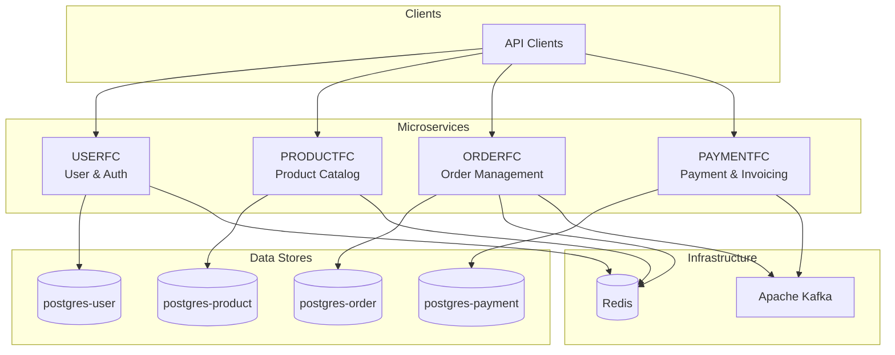
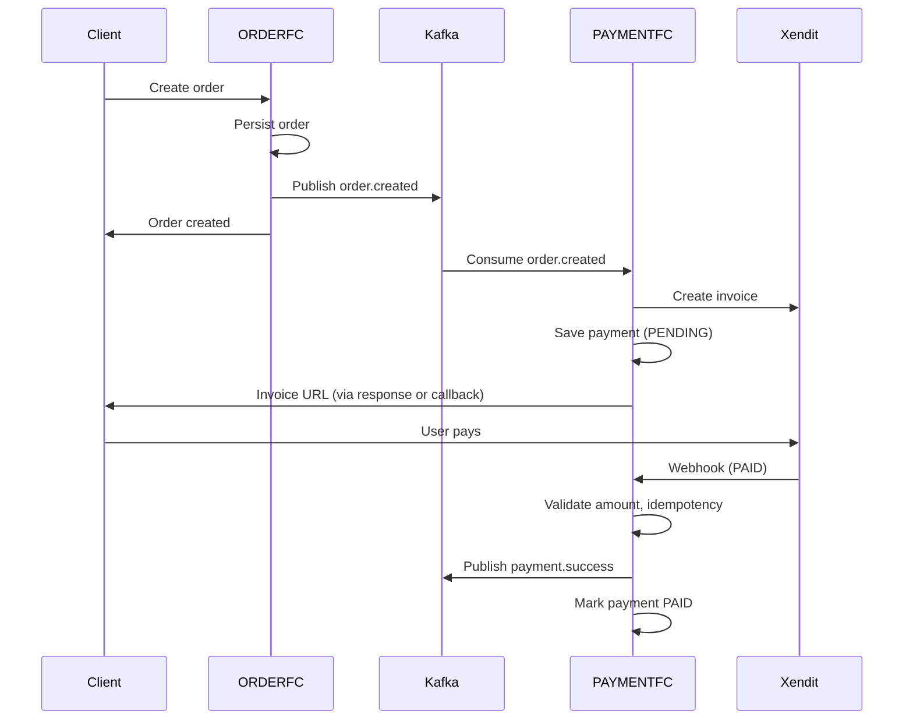

# Go Commerce

**Event-driven e-commerce platform built with Go and microservices architecture.**

A distributed system that handles user management, product catalog, order processing, and payment integration. Each domain runs as an independent service with its own database, communicating asynchronously via Apache Kafka.

---

## Architecture Overview

The system follows **Microservices Architecture** with **Database per Service**. Each bounded context owns its data and exposes capabilities via REST APIs and domain events.



---

## Services

| Service    | Port (Host) | Responsibility |
|-----------|-------------|----------------|
| **USERFC**    | 28080  | User registration, authentication (JWT), session/cache |
| **PRODUCTFC** | 28081  | Product catalog, inventory, product API |
| **ORDERFC**   | 28082  | Order creation, order state, publishes `order.created` |
| **PAYMENTFC** | 28083  | Xendit invoice creation, webhook handling, publishes `payment.success` |

Each service is a **Go** application (Gin, GORM) with a layered structure: Handler → Usecase → Service → Repository.

---

## Event-Driven Flow

Order-to-payment flow is event-driven. ORDERFC publishes domain events to Kafka; PAYMENTFC consumes them and reacts.



**Kafka topics**

- `order.created` — emitted by ORDERFC; consumed by PAYMENTFC to create invoices.
- `payment.success` — emitted by PAYMENTFC when payment is confirmed; can drive order fulfillment or notifications.

---

## Technology Stack

| Layer        | Technology |
|-------------|------------|
| Language    | Go 1.22+   |
| API         | Gin        |
| ORM         | GORM       |
| Message bus | Apache Kafka (segmentio/kafka-go) |
| Cache       | Redis      |
| Database    | PostgreSQL 15 (one instance per service) |
| Payment     | Xendit (invoicing & webhooks) |
| Container   | Docker, Docker Compose |

---

## Getting Started

### Prerequisites

- Docker & Docker Compose
- Go 1.22+ (for local development)
- Git (for submodules)

### 1. Clone and submodules

```bash
git clone <repository-url> go-commerce
cd go-commerce
git submodule update --init --recursive
```

### 2. Run locally (Docker Compose)

```bash
docker compose up -d
```

This starts:

- **PostgreSQL** × 4 (user, product, order, payment) — ports 5433–5436  
- **Redis** — 6379  
- **Kafka** + Zookeeper — 29092, 29093  
- **Kafdrop** (Kafka UI) — http://localhost:29000  
- **USERFC** — http://localhost:28080  
- **PRODUCTFC** — http://localhost:28081  
- **ORDERFC** — http://localhost:28082  
- **PAYMENTFC** — http://localhost:28083  

(Optional) For Xendit: set `XENDIT_SECRET_API_KEY`, `XENDIT_WEBHOOK_TOKEN` in a `.env` at project root.

---

## Project Structure

The repository is a **multi-repo monorepo** with Git submodules: each service is a separate repository, composed here for local and orchestrated deployment.

```
go-commerce/
├── docker-compose.yml    # Infrastructure + USERFC, PRODUCTFC, ORDERFC, PAYMENTFC
├── USERFC/               # User service (submodule)
├── PRODUCTFC/            # Product service (submodule)
├── ORDERFC/              # Order service (submodule)
└── PAYMENTFC/            # Payment service (submodule)
```

Within each service (e.g. PAYMENTFC):

- **cmd/** — Handler, Usecase, Service, Repository (layered), main wiring
- **config/** — Configuration (YAML, env override)
- **models/** — Domain and API models
- **infrastructure/** — Logging, constants, middleware
- **kafka/** — Consumers and producers

---

## Design Highlights

- **Database per service** — Each microservice has its own PostgreSQL database to ensure loose coupling and independent scaling.
- **Event-driven integration** — Order and payment flows are decoupled via Kafka; PAYMENTFC does not call ORDERFC over HTTP for order creation.
- **Idempotency** — Payment webhook handling checks `IsAlreadyPaid` and avoids duplicate processing.
- **Payment safeguards** — Amount validation (expected vs. webhook), anomaly logging (`payment_anomalies`), and failed-event recording (`failed_events`) for manual review and retry.
- **Kafka publish retry** — Exponential backoff (2^i seconds) when publishing `payment.success` to improve reliability under transient failures.

---

## License

This project is for portfolio and educational use.
