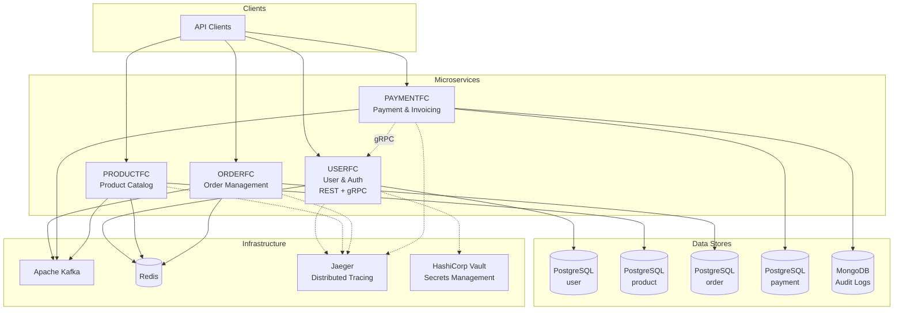
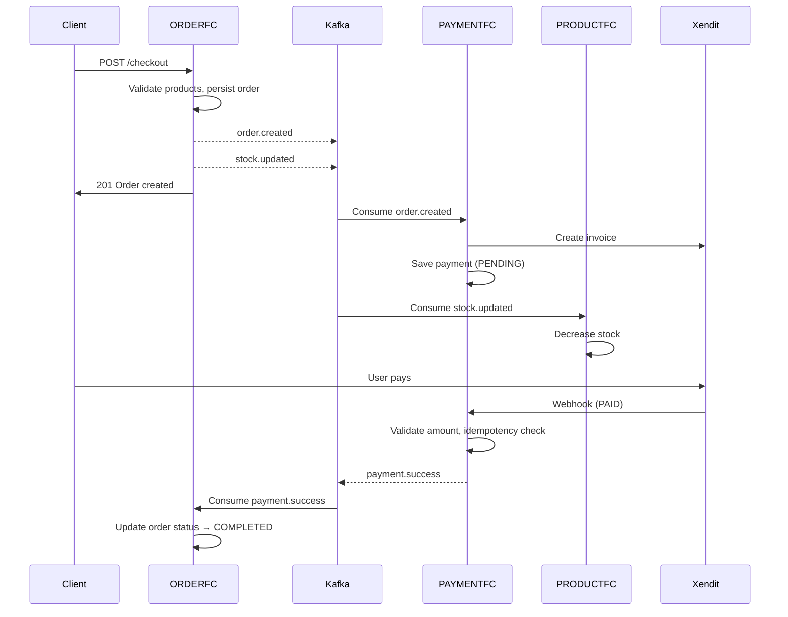
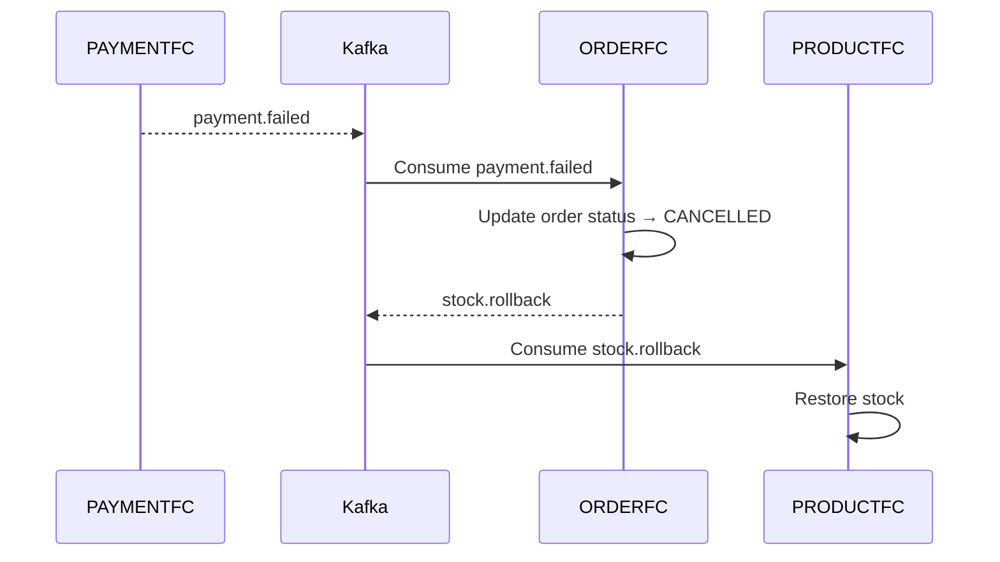

# Go Commerce

**Event-driven e-commerce platform built with Go and microservices architecture.**

A distributed system that handles user management, product catalog, order processing, and payment integration. Each domain runs as an independent service with its own database, communicating asynchronously via Apache Kafka and synchronously via gRPC where needed.

---

## Architecture Overview

The system follows **Microservices Architecture** with **Database per Service**. Each bounded context owns its data and exposes capabilities via REST APIs, gRPC, and domain events.


```mermaid
flowchart TB
    subgraph Clients["Clients"]
        API[API Clients]
    end

    subgraph Services["Microservices"]
        USERFC[USERFC<br/>User & Auth<br/>REST + gRPC]
        PRODUCTFC[PRODUCTFC<br/>Product Catalog]
        ORDERFC[ORDERFC<br/>Order Management]
        PAYMENTFC[PAYMENTFC<br/>Payment & Invoicing]
    end

    subgraph Data["Data Stores"]
        DB1[(PostgreSQL<br/>user)]
        DB2[(PostgreSQL<br/>product)]
        DB3[(PostgreSQL<br/>order)]
        DB4[(PostgreSQL<br/>payment)]
        MONGO[(MongoDB<br/>Audit Logs)]
    end

    subgraph Infrastructure["Infrastructure"]
        KAFKA[Apache Kafka]
        REDIS[(Redis)]
        JAEGER[Jaeger<br/>Distributed Tracing]
        VAULT[HashiCorp Vault<br/>Secrets Management]
    end

    API --> USERFC
    API --> PRODUCTFC
    API --> ORDERFC
    API --> PAYMENTFC

    PAYMENTFC -.->|gRPC| USERFC

    USERFC --> DB1
    USERFC --> REDIS
    PRODUCTFC --> DB2
    PRODUCTFC --> REDIS
    ORDERFC --> DB3
    ORDERFC --> REDIS
    PAYMENTFC --> DB4
    PAYMENTFC --> MONGO

    ORDERFC --> KAFKA
    PAYMENTFC --> KAFKA
    PRODUCTFC --> KAFKA

    USERFC -.-> JAEGER
    PRODUCTFC -.-> JAEGER
    ORDERFC -.-> JAEGER
    PAYMENTFC -.-> JAEGER

    USERFC -.-> VAULT
```

---

## Services

| Service       | HTTP Port | gRPC Port | Responsibility |
|--------------|-----------|-----------|----------------|
| **USERFC**    | 28080     | 50051     | User registration, authentication (JWT), user info via gRPC; Redis: sliding-window rate limit on login/register, JWT blacklist on logout |
| **PRODUCTFC** | 28081     | —         | Product & category CRUD, inventory management, stock via Kafka; Redis: cache-aside + invalidation, view-count ranking (Sorted Set) |
| **ORDERFC**   | 28082     | —         | Order creation, order history, publishes `order.created` & `stock.updated`, consumes `payment.success` & `payment.failed` |
| **PAYMENTFC** | 28083     | —         | Xendit invoice creation, webhook handling, batch processing, audit logging, publishes `payment.success` & `payment.failed` |

Each service is a **Go** application (Gin, GORM) with a layered structure:

```
Handler → Usecase → Service → Repository
```

---

## Event-Driven Flow

### Order → Payment → Stock (Happy Path)


```mermaid
sequenceDiagram
    participant Client
    participant ORDERFC
    participant Kafka
    participant PAYMENTFC
    participant PRODUCTFC
    participant Xendit

    Client->>ORDERFC: POST /checkout
    ORDERFC->>ORDERFC: Validate products, persist order
    ORDERFC-->>Kafka: order.created
    ORDERFC-->>Kafka: stock.updated
    ORDERFC->>Client: 201 Order created

    Kafka->>PAYMENTFC: Consume order.created
    PAYMENTFC->>Xendit: Create invoice
    PAYMENTFC->>PAYMENTFC: Save payment (PENDING)

    Kafka->>PRODUCTFC: Consume stock.updated
    PRODUCTFC->>PRODUCTFC: Decrease stock

    Client->>Xendit: User pays
    Xendit->>PAYMENTFC: Webhook (PAID)
    PAYMENTFC->>PAYMENTFC: Validate amount, idempotency check
    PAYMENTFC-->>Kafka: payment.success

    Kafka->>ORDERFC: Consume payment.success
    ORDERFC->>ORDERFC: Update order status → COMPLETED
```

### Payment Failure → Stock Rollback


```mermaid
sequenceDiagram
    participant PAYMENTFC
    participant Kafka
    participant ORDERFC
    participant PRODUCTFC

    PAYMENTFC-->>Kafka: payment.failed
    Kafka->>ORDERFC: Consume payment.failed
    ORDERFC->>ORDERFC: Update order status → CANCELLED
    ORDERFC-->>Kafka: stock.rollback

    Kafka->>PRODUCTFC: Consume stock.rollback
    PRODUCTFC->>PRODUCTFC: Restore stock
```

### Kafka Topics

| Topic            | Producer    | Consumer(s)           | Purpose |
|-----------------|-------------|-----------------------|---------|
| `order.created`  | ORDERFC     | PAYMENTFC             | Trigger invoice creation |
| `stock.updated`  | ORDERFC     | PRODUCTFC             | Decrease product stock on order |
| `stock.rollback` | ORDERFC     | PRODUCTFC             | Restore product stock on payment failure |
| `stock.updated.dlq` / `stock.rollback.dlq` | PRODUCTFC | (ops / replay) | Failed consumer messages (wrapped JSON) |
| `payment.success`| PAYMENTFC   | ORDERFC               | Mark order as completed |
| `payment.failed` | PAYMENTFC   | ORDERFC               | Mark order as cancelled, trigger stock rollback |

---

## Inter-Service Communication

| From | To | Protocol | Purpose |
|------|----|----------|---------|
| PAYMENTFC | USERFC | **gRPC** | Fetch user email for invoice creation |
| ORDERFC | PRODUCTFC | **HTTP** | Validate product info & stock before checkout |
| All services | — | **Kafka** | Asynchronous event-driven integration |

---

## Technology Stack

| Layer              | Technology |
|-------------------|------------|
| Language          | Go 1.22+ |
| HTTP Framework    | Gin |
| ORM               | GORM |
| Inter-service RPC | gRPC + Protocol Buffers |
| Message Broker    | Apache Kafka (segmentio/kafka-go) |
| Cache             | Redis 7 |
| Database          | PostgreSQL 15 (one instance per service) |
| Audit Log         | MongoDB 7 (append-only event store) |
| Payment Gateway   | Xendit (invoicing & webhooks) |
| Distributed Tracing | Jaeger + OpenTelemetry (OTLP) |
| Secrets Management | HashiCorp Vault |
| Container         | Docker, Docker Compose |
| API Documentation | Swagger (swaggo/gin-swagger) |
| Kafka UI          | Kafdrop |
| **Log aggregation** | Loki |
| **Metrics** | Prometheus, node_exporter (host), Go app `/metrics` (per process) |
| **Dashboards** | Grafana (Loki + Prometheus data sources) |
| **Log shipping** | Promtail (per service) |

---

## Getting Started

### Prerequisites

- Docker & Docker Compose
- Go 1.22+ (for local development)

### 1. Clone

```bash
git clone <repository-url> go-commerce
cd go-commerce
git submodule update --init --recursive
```

### 2. Run locally (Docker Compose)

```bash
docker compose up -d --build
```

This starts:

| Component | Host Port | URL / Address |
|-----------|-----------|---------------|
| PostgreSQL (user) | 5433 | `localhost:5433` |
| PostgreSQL (product) | 5434 | `localhost:5434` |
| PostgreSQL (order) | 5435 | `localhost:5435` |
| PostgreSQL (payment) | 5436 | `localhost:5436` |
| MongoDB (audit logs) | 27017 | `localhost:27017` |
| Redis | 6379 | `localhost:6379` |
| Kafka | 29092 / 29093 | `localhost:29092` |
| Zookeeper | 22181 | `localhost:22181` |
| Kafdrop (Kafka UI) | 29000 | http://localhost:29000 |
| Vault | 8200 | http://localhost:8200 |
| Jaeger UI | 16686 | http://localhost:16686 |
| USERFC | 28080 | http://localhost:28080 |
| USERFC gRPC | 50051 | `localhost:50051` |
| PRODUCTFC | 28081 | http://localhost:28081 |
| ORDERFC | 28082 | http://localhost:28082 |
| PAYMENTFC | 28083 | http://localhost:28083 |

| **Monitoring** | | |
| Loki | 3100 | http://localhost:3100 |
| Prometheus | 9090 | http://localhost:9090 |
| Grafana | 3002 | http://localhost:3002 |
| node_exporter | 9100 | http://localhost:9100/metrics |

Each service exposes **Swagger UI** for API documentation and try-it-out:

- USERFC: http://localhost:28080/swagger/index.html  
- PRODUCTFC: http://localhost:28081/swagger/index.html  
- ORDERFC: http://localhost:28082/swagger/index.html  
- PAYMENTFC: http://localhost:28083/swagger/index.html  

After changing handler annotations, regenerate docs with `swag init -g main.go` in the service directory (requires `go install github.com/swaggo/swag/cmd/swag@latest`).

---

## Monitoring (Loki, Prometheus, Grafana)

Centralized logs and metrics are provided by Loki, Prometheus, Grafana, Promtail, and node_exporter. All run in the same Docker Compose stack.

### Components

| Component | Role | Port |
|-----------|------|------|
| **Loki** | Log storage; receives log streams from Promtail | 3100 |
| **Prometheus** | Scrapes metrics from each FC `/metrics` and node_exporter | 9090 |
| **Grafana** | UI for dashboards and ad-hoc queries (logs + metrics) | 3002 |
| **Promtail** | Per-service agent; tails app log files and sends to Loki | — |
| **node_exporter** | Host-level metrics (CPU, memory, disk, network) | 9100 |

### Per-service setup

- **Application metrics**: Each FC exposes `GET /metrics` (Prometheus Go client). Prometheus scrapes `userfc:28080`, `productfc:8081`, `orderfc:8083`, `paymentfc:28083` from the compose network.
- **Logs**: Each FC writes stdout to a file (e.g. `/var/log/userfc/app.log`) via `tee`; a dedicated Promtail container per FC reads that path and sends to Loki with a `job` label (`userfc`, `productfc`, etc.).
- **Config in repo**: Each FC repo contains:
  - `promtail/promtail-config.yml` — what to tail and Loki push URL.
  - `prometheus/scrape-config.yml` — reference scrape config for that service (merged into the central `prometheus/prometheus.yml` at repo root).

Central config (single place):

- `loki/loki-config.yml` — Loki server config.
- `prometheus/prometheus.yml` — All scrape jobs (all FCs + node_exporter).

### Grafana

- **URL**: http://localhost:3002 (호스트 포트; Vite `3000`과 겹치지 않게 분리)
- **Login**: `admin` / `admin` (change on first use if prompted).
- **Phase 5 대시보드**: 프로비저닝으로 **Prometheus / Loki** 데이터소스와 **Go Commerce — HTTP RED** 대시보드가 로드됩니다 (`grafana/provisioning/`, `grafana/dashboards/`).
- **Data sources** (add once, then reuse):
  - **Loki**: URL `http://loki:3100` → Save & test.
  - **Prometheus**: URL `http://prometheus:9090` → Save & test.
- **Persistence**: Grafana data (dashboards, data sources, users) is stored in the `grafana_data` volume. Restarting or recreating the Grafana container does **not** reset the UI; only removing the volume would.

### Quick checks

| Check | How |
|-------|-----|
| Loki up | http://localhost:3100/ready → body `ready` |
| Prometheus targets | http://localhost:9090 → Status → Targets (userfc, productfc, orderfc, paymentfc, node) |
| Logs in Grafana | Explore → Data source Loki → query e.g. `{job="userfc"}` |
| Metrics in Grafana | Explore → Data source Prometheus → query e.g. `up` or `process_resident_memory_bytes` |

### 3. Environment Variables (Optional)

For Xendit integration, create a `.env` at project root:

```env
XENDIT_SECRET_API_KEY=xnd_development_...
XENDIT_WEBHOOK_TOKEN=your_webhook_token
```

---

## Project Structure

The repository is a **multi-repo monorepo** with Git submodules: each service is a separate repository, composed here for local and orchestrated deployment.

```
go-commerce/
├── docker-compose.yml
├── README.md
├── loki/                    # Loki server config
├── prometheus/              # Central Prometheus config (all scrape jobs)
├── USERFC/                  # User service (submodule)
├── PRODUCTFC/               # Product service (submodule)
├── ORDERFC/                 # Order service (submodule)
└── PAYMENTFC/               # Payment service (submodule)
```

Within each service:

```
<SERVICE>/
├── cmd/<domain>/
│   ├── handler/             # HTTP handlers (Gin)
│   ├── usecase/             # Business logic orchestration
│   ├── service/             # Domain service layer
│   ├── repository/          # Data access (DB, Redis, HTTP)
│   └── resource/            # DB/Redis connection setup
├── config/                  # Configuration (YAML + env override)
├── docs/                    # Swagger-generated docs (swag init)
├── models/                  # Domain models, DTOs, event structs
├── kafka/                   # Kafka producers and consumers
├── tracing/                 # OpenTelemetry / Jaeger setup
├── middleware/              # Auth, request logging middleware
├── routes/                  # Route registration
├── infrastructure/          # Logging (zerolog), constants
├── grpc/                    # gRPC server/client (USERFC, PAYMENTFC)
├── pb/                      # Protocol Buffer generated code
├── promtail/                # Promtail config (log path, Loki URL)
├── prometheus/              # Scrape-config fragment for this service
├── files/config/            # config.yaml
├── Dockerfile
└── main.go
```

---

## Design Highlights

### Microservices & Data Isolation
- **Database per service** — Each microservice has its own PostgreSQL database to ensure loose coupling and independent scaling.
- **Polyglot persistence** — PostgreSQL for transactional data, MongoDB for append-only audit logs, Redis for caching. Each data store is chosen based on access patterns.

### Event-Driven Architecture
- **Asynchronous integration** — Order and payment flows are decoupled via Kafka. Services react to domain events instead of making synchronous HTTP calls.
- **Saga pattern (choreography)** — Order → Stock deduction → Payment → Success/Failure → Stock rollback. Each service listens to events and compensates on failure.
- **5 Kafka topics** — `order.created`, `stock.updated`, `stock.rollback`, `payment.success`, `payment.failed` form the complete order lifecycle.

### Payment Processing
- **Xendit integration** — Real-time invoice creation via Xendit API, webhook-based payment confirmation.
- **Feature toggle** — `disable_create_invoice_directly` switches between real-time invoice creation and batch processing mode.
- **Batch processing** — Background schedulers handle pending payment requests, retry failed invoices, sweep expired payments, and check invoice statuses.
- **Idempotency** — Payment webhook handling checks `IsAlreadyPaid` to avoid duplicate processing.
- **Payment safeguards** — Amount validation (expected vs. webhook), anomaly logging (`payment_anomalies`), and failed-event recording (`failed_events`) for manual review and retry.
- **Kafka publish retry** — Exponential backoff (2^n seconds) when publishing `payment.success` to improve reliability under transient failures.

### Observability
- **Distributed tracing** — All services export traces via OpenTelemetry (OTLP) to Jaeger. Each HTTP request is traced across service boundaries.
- **Structured logging** — zerolog with JSON output across all services.
- **Audit logging** — All payment events (created, paid, failed, expired) are logged to MongoDB for traceability and debugging.
- **Centralized logs** — Loki stores log streams; Promtail (one per FC) ships from app log files. Grafana Explore queries by `job` (e.g. `userfc`, `paymentfc`).
- **Metrics** — Each FC exposes `/metrics` (Prometheus Go client: process + Go runtime). node_exporter provides host-level metrics. Prometheus scrapes all; Grafana visualizes.

### Security & Configuration
- **Secrets management** — HashiCorp Vault for sensitive configuration (API keys, DB credentials).
- **JWT authentication** — USERFC issues JWT tokens; other services validate via gRPC or middleware.
- **Token revocation** — Logout stores a SHA256 hash of the JWT in Redis with TTL = remaining lifetime; protected routes reject revoked tokens before signature validation.
- **API abuse mitigation** — Login and register use a Redis Sorted Set sliding-window limiter (per client IP, 10 requests / 60s).
- **gRPC inter-service** — PAYMENTFC fetches user info from USERFC via gRPC for type-safe, high-performance communication.

### Code Quality
- **Layered architecture** — Handler → Usecase → Service → Repository. Clear separation of concerns.
- **SQL injection prevention** — OrderBy/Sort whitelist validation in search queries.
- **Idempotency tokens** — Order creation supports idempotency tokens to prevent duplicate orders.

---

## API Endpoints (Summary)

### USERFC
| Method | Path | Description |
|--------|------|-------------|
| POST | `/v1/register` | Register new user (rate limited) |
| POST | `/v1/login` | Login and get JWT token (rate limited) |
| POST | `/v1/logout` | Revoke current JWT (Redis blacklist) |
| GET | `/api/v1/user-info` | Get current user info |
| GET | `/debug/queries` | DB query observability (Phase 1) |
| GET | `/debug/redis` | Redis connection / key count (Phase 2) |

### PRODUCTFC
| Method | Path | Description |
|--------|------|-------------|
| GET | `/v1/products/:id` | Get product by ID |
| GET | `/v1/products/ranking` | Popular products by view count (Redis Sorted Set) |
| GET | `/v1/products/search` | Search products (filtering, sorting, pagination) |
| GET | `/v1/product-categories/:id` | Get category by ID |
| GET | `/debug/queries` | DB query observability (Phase 1) |
| GET | `/debug/redis` | Cache hit/miss stats + Redis key count (Phase 2) |
| GET | `/debug/kafka` | Kafka consumer stats, DLQ count (Phase 3) |
| GET | `/debug/kafka/stream` | SSE: consumer stats every 2s (Phase 3) |
| POST | `/api/v1/products` | Create product |
| PUT | `/api/v1/products/:id` | Update product |
| DELETE | `/api/v1/products/:id` | Delete product |
| POST | `/api/v1/product-categories` | Create category |
| PUT | `/api/v1/product-categories/:id` | Update category |
| DELETE | `/api/v1/product-categories/:id` | Delete category |

### ORDERFC
| Method | Path | Description |
|--------|------|-------------|
| POST | `/api/v1/orders` | Create order (checkout) |
| GET | `/api/v1/orders/history` | Get order history by user |

### PAYMENTFC
| Method | Path | Description |
|--------|------|-------------|
| POST | `/v1/payment/webhook` | Xendit webhook callback |
| POST | `/api/v1/payment/invoice` | Create invoice |
| GET | `/api/v1/invoice/:order_id/pdf` | Download invoice PDF |
| GET | `/api/v1/failed_payments` | List failed payments |
| GET | `/debug/mongo/audit-logs` | 감사 로그 목록 (필터·커서 페이지네이션, Phase 4) |
| GET | `/debug/mongo/audit-report/daily` | 일별·이벤트별 집계 (Aggregation, Phase 4) |
| GET | `/debug/mongo/stream` | SSE: 감사 로그 insert 스트림 (Change Stream, Replica Set 권장, Phase 4) |
| GET | `/api/v1/audit-logs` | 위 목록과 동일 (JWT 필요) |
| GET | `/api/v1/audit-report/daily` | 위 일별 리포트와 동일 (JWT 필요) |

프론트 대시보드 **MongoDB** 탭(`MongoPage`)은 개발 시 Vite 프록시 기준으로 위 경로를 호출합니다. Docker로 띄운 정적 프론트는 **호스트 `3001`**(compose의 `frontend` 서비스)에서 동일 UI를 제공합니다.

---

## Technical Improvements

각 기술을 **"연결만 한 상태"** 에서 **"실무 수준으로 활용하는 상태"** 로 개선한 과정을 상세하게 기록했습니다.

> **[docs/improvements/](./docs/improvements/)** — 전체 개선 기록 보기

| Phase | 주제 | 핵심 키워드 |
|-------|------|------------|
| 0 | 모니터링 대시보드 | React, Vite, CORS Proxy |
| 1 | [PostgreSQL 심화](./docs/improvements/phase1-postgresql.md) | GORM Callback, 인덱스, FOR UPDATE, CTE, Window Function |
| 2 | [Redis 패턴](./docs/improvements/phase2-redis.md) | 캐시 무효화(Cache-Aside DEL), Hit/Miss 모니터, 조회수 랭킹(ZINCRBY/ZREVRANGE), 슬라이딩 윈도 Rate Limit(ZSET), JWT 블랙리스트 |
| 3 | [Kafka 아키텍처](./docs/improvements/phase3-kafka.md) | DLQ 토픽, Redis 멱등 키, Hash 파티셔너+user_id 키, schema_version, `/debug/kafka` |
| 4 | [MongoDB 분석](./docs/improvements/phase4-mongodb.md) | Aggregation Pipeline, Change Stream, TTL |
| 5 | [Observability](./docs/improvements/phase5-observability.md) | HTTP RED·Xendit 카운터, Prometheus 알림, Grafana 프로비저닝, Kafka/gRPC 스팬, SLI/SLO 개념 |

---

## Production & operations (백업·고가용성 개념)

이 레포의 **docker-compose**는 학습·포트폴리오용으로 **단일 PostgreSQL / 단일 Redis**에 가깝습니다. 아래는 **실제 운영**에서 자주 묻는 개념을 README에만 요약해 둔 것입니다. (상세 구현은 이 저장소 범위 밖입니다.)

### 복구 목표 (면접·설계에서 자주 나옴)

| 용어 | 의미 |
|------|------|
| **RPO** (Recovery Point Objective) | 장애 시 **어느 시점까지** 데이터를 되살릴 수 있는가 — 백업 주기·복제 방식이 결정 |
| **RTO** (Recovery Time Objective) | 장애 후 **몇 분 안에** 서비스를 복구하는가 — 자동 페일오버·런북·복구 연습이 결정 |
| **HA** (High Availability) | 단일 장애를 견디도록 **복제·전환**을 설계하는 것 (보통 동일 리전 내) |
| **DR** (Disaster Recovery) | 리전/데이터센터 단위 재난에 대비한 **이중화·복구 계획** (HA보다 범위가 큼) |

> **백업**은 RPO를, **스탠바이·페일오버**는 RTO·가용성을 맡는 경우가 많습니다. 둘 다 필요한 서비스가 많습니다.

### PostgreSQL (운영에서 자주 하는 말)

- **고가용성**: Streaming replication (동기/비동기), 자동 페일오버(Patroni, repmgr, **관리형 RDS Multi-AZ** 등), 읽기 전용 replica로 리포트 부하 분산.
- **백업·복구**: 논리 백업(`pg_dump`) vs **물리 백업 + WAL 아카이빙**으로 **PITR**(특정 시점 복구). **복구 드릴**(백업 파일에서 실제로 올려보기)이 있는지가 운영 성숙도 지표로 잡히기도 함.
- **그 외**: 연결 풀(PgBouncer), TLS, 시크릿 관리, VACUUM/장기 트랜잭션, 슬로우 쿼리·복제 지연·디스크 모니터링.

### Redis (운영에서 자주 하는 말)

- **역할에 따라 난이도가 갈림**: 순수 캐시(유실 허용) vs 세션·Rate limit·랭킹 등 **유실이 비즈에 영향** → 지속성·복제 정책을 더 타이트하게.
- **고가용성**: **Redis Sentinel** — 단일 키 스페이스, 마스터+복제, 장애 시 승격. **Redis Cluster** — 슬롯 샤딩으로 수평 확장, 클러스터 인식 클라이언트 필요.
- **지속성**: **RDB**(주기 스냅샷, 간단하지만 스냅샷 사이 유실 구간), **AOF**(append, `appendfsync` 정책에 따라 디스크·유실 트레이드오프).
- **백업**: RDB/AOF 스냅샷 또는 관리형 자동 백업. PG처럼 “표준 PITR” 이야기보다 **스냅샷 + 복제**가 일반적.
- **그 외**: `maxmemory`·eviction 정책, hot key/big key, TLS·ACL, private network.

### 한눈에 비교

| 항목 | PostgreSQL | Redis |
|------|------------|--------|
| HA 핵심 | 복제 + 자동 페일오버 | Sentinel(복제) vs Cluster(샤딩) |
| 백업 핵심 | Dump vs 베이스+WAL(PITR) | RDB/AOF / 관리형 스냅샷 |
| 유실·일관성 | 동기 복제, checkpoint | AOF fsync, 복제 lag |

### 이 프로젝트와의 관계

- 로컬 스택은 **운영급 백업·HA·암호화·정책**을 포함하지 않습니다.
- 면접에서는 **“패턴은 코드로 익혔고, 프로덕션에서는 RPO/RTO에 맞춰 RDS·ElastiCache 등에서 복제·백업·모니터링을 설계한다”**처럼 구분해서 말하면 됩니다.

---

## Roadmap

- [ ] Kubernetes deployment (local K8s + Helm charts)
- [x] Loki + Grafana + Prometheus for centralized logging and metrics
- [ ] Kafka production-grade configuration (partitions, replication, DLQ)
- [x] CI/CD pipeline (GitHub Actions)

---

## License

This project is for portfolio and educational use.
