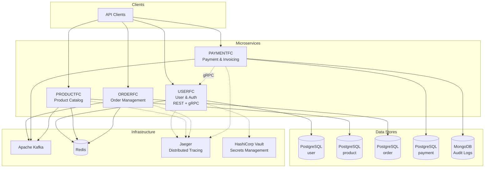
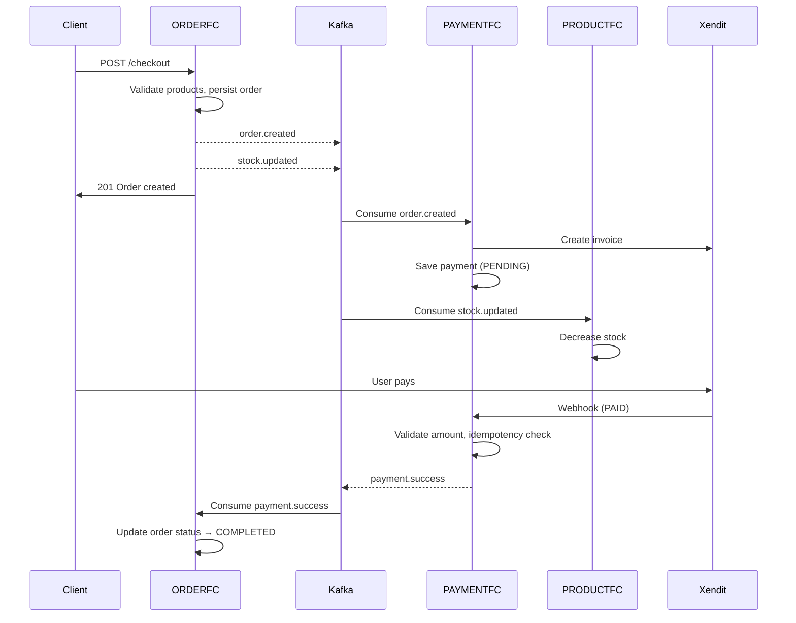
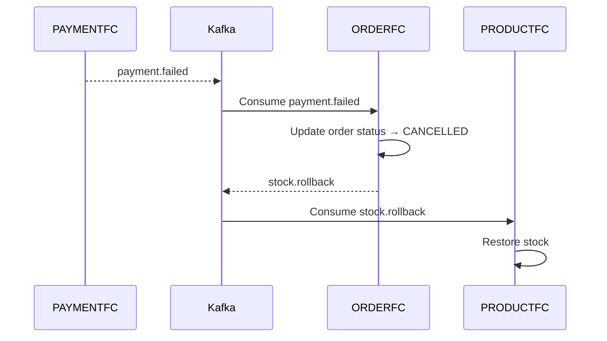
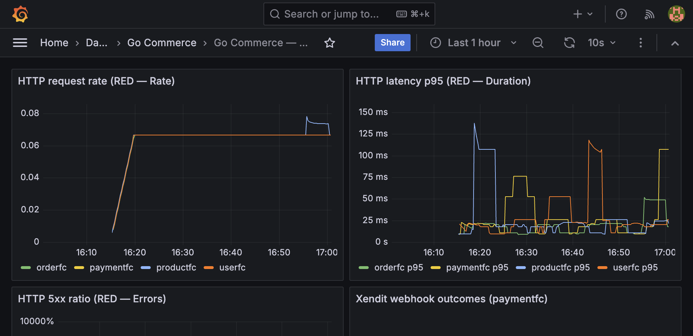
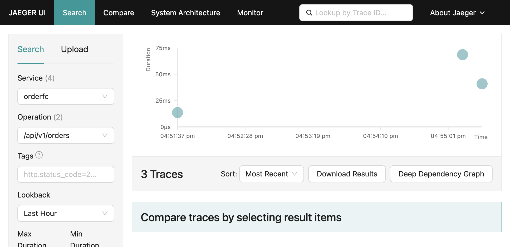
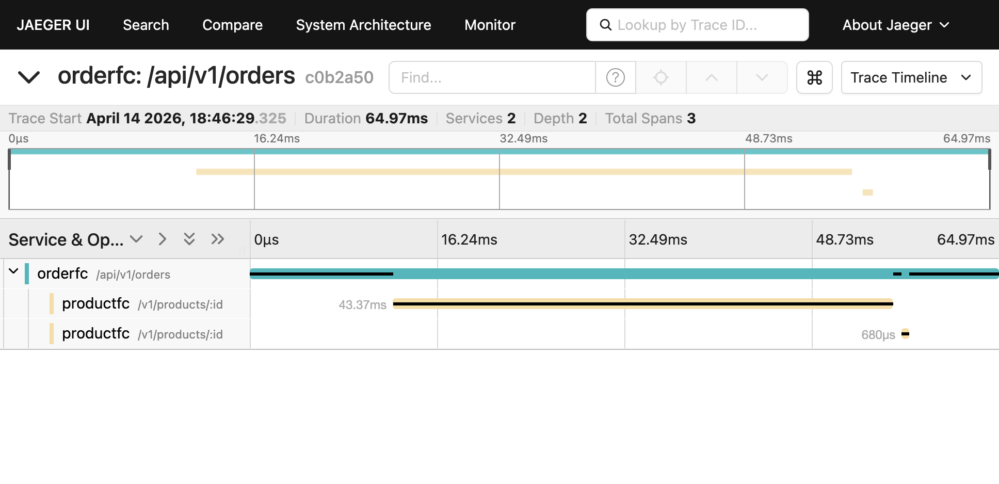

# Go Commerce

**Go 기반 이벤트 드리븐 커머스 플랫폼 (마이크로서비스 아키텍처)**

> **운영 도메인 (Main): [https://hongjunho.xyz](https://hongjunho.xyz)**

사용자 관리, 상품 카탈로그, 주문 처리, 결제 연동을 담당하는 분산 시스템입니다. 각 도메인은 독립된 서비스로 운영되며, 자체 데이터베이스를 보유하고 Apache Kafka를 통한 비동기 통신과 gRPC를 통한 동기 통신을 사용합니다.

## 빠른 링크

- **운영 서비스**: [https://hongjunho.xyz](https://hongjunho.xyz)
- **메인 아키텍처(HTML)**: [docs/architecture-v2.html](docs/architecture-v2.html)
- **아키텍처 문서(설명)**: [docs/architecture.md](docs/architecture.md)
- **RAG Q&A 소스**: [`tools/project-qa-assistant`](tools/project-qa-assistant)

---

## 아키텍처 개요

**Microservices Architecture** + **Database per Service** 구조를 따릅니다. 각 Bounded Context가 자체 데이터를 소유하고, REST API·gRPC·도메인 이벤트를 통해 기능을 제공합니다.

**상세 다이어그램 (레이어, 관측성, Xendit):** [docs/architecture.md](docs/architecture.md)
**메인 HTML 다이어그램:** [docs/architecture-v2.html](docs/architecture-v2.html)


```mermaid
flowchart TB
    subgraph Clients["Clients"]
        API[API Clients]
    end

    subgraph Services["Microservices"]
        USERFC[USERFC<br/>User & Auth<br/>REST + gRPC]
        PRODUCTFC[PRODUCTFC<br/>Product Catalog]
        ORDERFC[ORDERFC<br/>Order Management]
        PAYMENTFC[PAYMENTFC<br/>Payment & Invoicing]
    end

    subgraph Data["Data Stores"]
        DB1[(PostgreSQL<br/>user)]
        DB2[(PostgreSQL<br/>product)]
        DB3[(PostgreSQL<br/>order)]
        DB4[(PostgreSQL<br/>payment)]
        MONGO[(MongoDB<br/>Audit Logs)]
    end

    subgraph Infrastructure["Infrastructure"]
        KAFKA[Apache Kafka]
        REDIS[(Redis)]
        JAEGER[Jaeger<br/>Distributed Tracing]
        VAULT[HashiCorp Vault<br/>Secrets Management]
    end

    API --> USERFC
    API --> PRODUCTFC
    API --> ORDERFC
    API --> PAYMENTFC

    PAYMENTFC -.->|gRPC| USERFC

    USERFC --> DB1
    USERFC --> REDIS
    PRODUCTFC --> DB2
    PRODUCTFC --> REDIS
    ORDERFC --> DB3
    ORDERFC --> REDIS
    PAYMENTFC --> DB4
    PAYMENTFC --> MONGO

    ORDERFC --> KAFKA
    PAYMENTFC --> KAFKA
    PRODUCTFC --> KAFKA

    USERFC -.-> JAEGER
    PRODUCTFC -.-> JAEGER
    ORDERFC -.-> JAEGER
    PAYMENTFC -.-> JAEGER

    USERFC -.-> VAULT
```

---

## Project Q&A Assistant (RAG)

go-commerce 코드베이스를 근거 기반으로 질의응답하는 RAG 보조 시스템입니다.  
아키텍처 `v2` 다이어그램의 Edge 레이어에 공식 반영했습니다.

- **런타임**: React(Vite) + Nginx + FastAPI
- **검색/생성**: Chroma retrieval + OpenAI synthesis
- **응답 정책**: evidence path 표기, confidence(`high/medium/low/none`) 반환
- **소스 경로**: `tools/project-qa-assistant`
- **운영 도메인**: [https://hongjunho.xyz](https://hongjunho.xyz)

---

## 서비스 구성

| 서비스 | HTTP 포트 | gRPC 포트 | 역할 |
|--------|-----------|-----------|------|
| **USERFC** | 28080 | 50051 | 회원 가입·인증(JWT), gRPC를 통한 사용자 정보 제공; Redis: 슬라이딩 윈도우 Rate Limit(로그인/회원가입), JWT 블랙리스트(로그아웃) |
| **PRODUCTFC** | 28081 | — | 상품·카테고리 CRUD, 재고 관리, Kafka를 통한 재고 처리; Redis: Cache-Aside + 무효화, 조회수 랭킹(Sorted Set) |
| **ORDERFC** | 28082 | — | 주문 생성, 주문 이력 조회, `order.created`·`stock.updated` 발행, `payment.success`·`payment.failed` 구독 |
| **PAYMENTFC** | 28083 | — | Xendit 인보이스 생성, 웹훅 처리, 배치 처리, 감사 로깅, `payment.success`·`payment.failed` 발행 |

각 서비스는 **Go** 애플리케이션(Gin, GORM)으로, 레이어드 아키텍처를 따릅니다:

```
Handler → Usecase → Service → Repository
```

---

## 이벤트 드리븐 흐름

### 주문 → 결제 → 재고 (정상 흐름)


```mermaid
sequenceDiagram
    participant Client
    participant ORDERFC
    participant Kafka
    participant PAYMENTFC
    participant PRODUCTFC
    participant Xendit

    Client->>ORDERFC: POST /checkout
    ORDERFC->>ORDERFC: Validate products, persist order
    ORDERFC-->>Kafka: order.created
    ORDERFC-->>Kafka: stock.updated
    ORDERFC->>Client: 201 Order created

    Kafka->>PAYMENTFC: Consume order.created
    PAYMENTFC->>Xendit: Create invoice
    PAYMENTFC->>PAYMENTFC: Save payment (PENDING)

    Kafka->>PRODUCTFC: Consume stock.updated
    PRODUCTFC->>PRODUCTFC: Decrease stock

    Client->>Xendit: User pays
    Xendit->>PAYMENTFC: Webhook (PAID)
    PAYMENTFC->>PAYMENTFC: Validate amount, idempotency check
    PAYMENTFC-->>Kafka: payment.success

    Kafka->>ORDERFC: Consume payment.success
    ORDERFC->>ORDERFC: Update order status → COMPLETED
```

### 결제 실패 → 재고 롤백


```mermaid
sequenceDiagram
    participant PAYMENTFC
    participant Kafka
    participant ORDERFC
    participant PRODUCTFC

    PAYMENTFC-->>Kafka: payment.failed
    Kafka->>ORDERFC: Consume payment.failed
    ORDERFC->>ORDERFC: Update order status → CANCELLED
    ORDERFC-->>Kafka: stock.rollback

    Kafka->>PRODUCTFC: Consume stock.rollback
    PRODUCTFC->>PRODUCTFC: Restore stock
```

### Kafka 토픽

| 토픽 | Producer | Consumer | 용도 |
|------|----------|----------|------|
| `order.created` | ORDERFC | PAYMENTFC | 인보이스 생성 트리거 |
| `stock.updated` | ORDERFC | PRODUCTFC | 주문 시 상품 재고 차감 |
| `stock.rollback` | ORDERFC | PRODUCTFC | 결제 실패 시 재고 복구 |
| `stock.updated.dlq` / `stock.rollback.dlq` | PRODUCTFC | (운영 / 재처리) | 처리 실패 메시지 (JSON 래핑) |
| `payment.success` | PAYMENTFC | ORDERFC | 주문 상태 완료 처리 |
| `payment.failed` | PAYMENTFC | ORDERFC | 주문 취소 및 재고 롤백 트리거 |

---

## 서비스 간 통신

| 출발 | 도착 | 프로토콜 | 용도 |
|------|------|----------|------|
| PAYMENTFC | USERFC | **gRPC** | 인보이스 생성 시 사용자 이메일 조회 |
| ORDERFC | PRODUCTFC | **HTTP** | 체크아웃 전 상품 정보·재고 검증 |
| 전체 서비스 | — | **Kafka** | 비동기 이벤트 기반 연동 |

---

## 기술 스택

| 구분 | 기술 |
|------|------|
| 언어 | Go 1.22+ |
| HTTP 프레임워크 | Gin |
| ORM | GORM |
| 서비스 간 RPC | gRPC + Protocol Buffers |
| 메시지 브로커 | Apache Kafka (segmentio/kafka-go) |
| 캐시 | Redis 7 |
| 데이터베이스 | PostgreSQL 15 (서비스별 독립 인스턴스) |
| 감사 로그 | MongoDB 7 (append-only 이벤트 저장소) |
| 결제 게이트웨이 | Xendit (인보이스 및 웹훅) |
| 분산 트레이싱 | Jaeger + OpenTelemetry (OTLP) |
| 시크릿 관리 | HashiCorp Vault |
| 컨테이너 | Docker, Docker Compose |
| API 문서 | Swagger (swaggo/gin-swagger) |
| Kafka UI | Kafdrop |
| 로그 수집 | Loki |
| 메트릭 | Prometheus, node_exporter (호스트), Go 앱 `/metrics` (프로세스별) |
| 대시보드 | Grafana (Loki + Prometheus 데이터소스) |
| 로그 전송 | Promtail (서비스별) |

---

## 실행 방법

### 사전 준비

- Docker & Docker Compose
- Go 1.22+ (로컬 개발 시)

### 1. 클론

```bash
git clone <repository-url> go-commerce
cd go-commerce
git submodule update --init --recursive
```

### 2. 로컬 실행 (Docker Compose)

```bash
docker compose up -d --build
```

실행 시 구성되는 컴포넌트:

| 컴포넌트 | 호스트 포트 | 주소 |
|----------|------------|------|
| PostgreSQL (user) | 5433 | `localhost:5433` |
| PostgreSQL (product) | 5434 | `localhost:5434` |
| PostgreSQL (order) | 5435 | `localhost:5435` |
| PostgreSQL (payment) | 5436 | `localhost:5436` |
| MongoDB (감사 로그) | 27017 | `localhost:27017` |
| Redis | 6379 | `localhost:6379` |
| Kafka | 29092 / 29093 | `localhost:29092` |
| Zookeeper | 22181 | `localhost:22181` |
| Kafdrop (Kafka UI) | 29000 | http://localhost:29000 |
| Vault | 8200 | http://localhost:8200 |
| Jaeger UI | 16686 | http://localhost:16686 |
| USERFC | 28080 | http://localhost:28080 |
| USERFC gRPC | 50051 | `localhost:50051` |
| PRODUCTFC | 28081 | http://localhost:28081 |
| ORDERFC | 28082 | http://localhost:28082 |
| PAYMENTFC | 28083 | http://localhost:28083 |

| **모니터링** | | |
|-------------|---|---|
| Loki | 3100 | http://localhost:3100 |
| Prometheus | 9090 | http://localhost:9090 |
| Grafana | 3002 | http://localhost:3002 |
| node_exporter | 9100 | http://localhost:9100/metrics |

각 서비스는 **Swagger UI**를 제공합니다:

- USERFC: http://localhost:28080/swagger/index.html  
- PRODUCTFC: http://localhost:28081/swagger/index.html  
- ORDERFC: http://localhost:28082/swagger/index.html  
- PAYMENTFC: http://localhost:28083/swagger/index.html  

핸들러 어노테이션 변경 후 `swag init -g main.go`로 문서를 재생성합니다 (`go install github.com/swaggo/swag/cmd/swag@latest` 필요).

### 운영 엔드포인트

- **Public**: [https://hongjunho.xyz](https://hongjunho.xyz)
- **TLS**: Let's Encrypt 인증서 적용 (자동 갱신 설정)
- **Routing**: Host Nginx(80/443) -> web container(`3001`) -> internal API(`/api`)

### 3. 환경 변수 (선택)

Xendit 연동 시 프로젝트 루트에 `.env` 파일을 생성합니다:

```env
XENDIT_SECRET_API_KEY=xnd_development_...
XENDIT_WEBHOOK_TOKEN=your_webhook_token
```

---

## 모니터링 (Loki, Prometheus, Grafana)

Loki, Prometheus, Grafana, Promtail, node_exporter를 통해 로그와 메트릭을 중앙 수집합니다. 모두 동일한 Docker Compose 스택에서 실행됩니다.

### 구성 요소

| 컴포넌트 | 역할 | 포트 |
|----------|------|------|
| **Loki** | 로그 저장소; Promtail로부터 로그 스트림 수신 | 3100 |
| **Prometheus** | 각 서비스의 `/metrics`와 node_exporter에서 메트릭 수집 | 9090 |
| **Grafana** | 대시보드 및 탐색 UI (로그 + 메트릭) | 3002 |
| **Promtail** | 서비스별 에이전트; 앱 로그 파일을 읽어 Loki로 전송 | — |
| **node_exporter** | 호스트 레벨 메트릭 (CPU, 메모리, 디스크, 네트워크) | 9100 |

### 서비스별 설정

- **애플리케이션 메트릭**: 각 서비스가 `GET /metrics`를 노출(Prometheus Go 클라이언트). Prometheus가 compose 네트워크 내에서 `userfc:28080`, `productfc:8081`, `orderfc:8083`, `paymentfc:28083`을 스크래핑합니다.
- **로그**: 각 서비스가 stdout을 파일(예: `/var/log/userfc/app.log`)로 `tee`하고, 전용 Promtail 컨테이너가 해당 경로를 읽어 `job` 라벨(`userfc`, `productfc` 등)과 함께 Loki로 전송합니다.
- **레포 내 설정 파일**: 각 서비스 레포에 포함:
  - `promtail/promtail-config.yml` — 수집 대상 경로와 Loki push URL
  - `prometheus/scrape-config.yml` — 해당 서비스의 스크래핑 설정 (루트의 `prometheus/prometheus.yml`에 통합)

중앙 설정:

- `loki/loki-config.yml` — Loki 서버 설정
- `prometheus/prometheus.yml` — 전체 스크래핑 작업 (모든 서비스 + node_exporter)

### Grafana

- **URL**: http://localhost:3002 (Vite `3000`과 포트 충돌 방지를 위해 분리)
- **로그인**: `admin` / `admin`
- **프로비저닝 대시보드**: Prometheus / Loki 데이터소스와 **Go Commerce — HTTP RED** 대시보드가 자동 로드됩니다 (`grafana/provisioning/`, `grafana/dashboards/`)

#### Go Commerce — HTTP RED 대시보드


- **데이터소스 설정**:
  - **Loki**: URL `http://loki:3100` → Save & test
  - **Prometheus**: URL `http://prometheus:9090` → Save & test
- **영속성**: Grafana 데이터(대시보드, 데이터소스, 사용자)는 `grafana_data` 볼륨에 저장됩니다. 컨테이너를 재시작해도 유지되며, 볼륨을 삭제해야만 초기화됩니다.

### 상태 확인

| 확인 항목 | 방법 |
|-----------|------|
| Loki 정상 동작 | http://localhost:3100/ready → `ready` 응답 |
| Prometheus 타겟 | http://localhost:9090 → Status → Targets |
| Grafana 로그 | Explore → Loki 데이터소스 → `{job="userfc"}` |
| Grafana 메트릭 | Explore → Prometheus 데이터소스 → `up` 또는 `process_resident_memory_bytes` |

---

## 프로젝트 구조

Git 서브모듈을 사용한 **멀티 레포 모노레포** 구조입니다. 각 서비스는 독립 레포지토리이며, 여기서 로컬 통합 실행 및 오케스트레이션을 위해 구성됩니다.

```
go-commerce/
├── docker-compose.yml
├── README.md
├── tools/project-qa-assistant/ # RAG 기반 코드 Q&A 웹/API (서브프로젝트)
├── loki/                    # Loki 서버 설정
├── prometheus/              # Prometheus 중앙 설정 (전체 스크래핑 작업)
├── USERFC/                  # 사용자 서비스 (서브모듈)
├── PRODUCTFC/               # 상품 서비스 (서브모듈)
├── ORDERFC/                 # 주문 서비스 (서브모듈)
└── PAYMENTFC/               # 결제 서비스 (서브모듈)
```

각 서비스 내부 구조:

```
<SERVICE>/
├── cmd/<domain>/
│   ├── handler/             # HTTP 핸들러 (Gin)
│   ├── usecase/             # 비즈니스 로직 오케스트레이션
│   ├── service/             # 도메인 서비스 레이어
│   ├── repository/          # 데이터 접근 (DB, Redis, HTTP)
│   └── resource/            # DB/Redis 연결 설정
├── config/                  # 설정 (YAML + 환경변수 오버라이드)
├── docs/                    # Swagger 생성 문서 (swag init)
├── models/                  # 도메인 모델, DTO, 이벤트 구조체
├── kafka/                   # Kafka Producer / Consumer
├── tracing/                 # OpenTelemetry / Jaeger 설정
├── middleware/              # 인증, 요청 로깅 미들웨어
├── routes/                  # 라우트 등록
├── infrastructure/          # 로깅 (zerolog), 상수
├── grpc/                    # gRPC 서버/클라이언트 (USERFC, PAYMENTFC)
├── pb/                      # Protocol Buffer 생성 코드
├── promtail/                # Promtail 설정 (로그 경로, Loki URL)
├── prometheus/              # 해당 서비스의 스크래핑 설정
├── files/config/            # config.yaml
├── Dockerfile
└── main.go
```

---

## 설계 핵심 사항

### 마이크로서비스 & 데이터 격리
- **서비스별 독립 DB** — 각 서비스가 자체 PostgreSQL 데이터베이스를 보유하여 느슨한 결합과 독립적 확장을 보장합니다.
- **Polyglot Persistence** — 트랜잭션 데이터는 PostgreSQL, append-only 감사 로그는 MongoDB, 캐싱은 Redis. 접근 패턴에 따라 데이터 저장소를 선택했습니다.

### 이벤트 드리븐 아키텍처
- **비동기 통합** — 주문과 결제 흐름을 Kafka로 분리하여, 동기 HTTP 호출 대신 도메인 이벤트에 반응합니다.
- **Saga 패턴 (Choreography)** — 주문 → 재고 차감 → 결제 → 성공/실패 → 재고 롤백. 각 서비스가 이벤트를 수신하고 실패 시 보상 처리합니다.
- **5개의 Kafka 토픽** — `order.created`, `stock.updated`, `stock.rollback`, `payment.success`, `payment.failed`가 주문 전체 라이프사이클을 구성합니다.

### 결제 처리
- **Xendit 연동** — Xendit API를 통한 실시간 인보이스 생성, 웹훅 기반 결제 확인.
- **Feature Toggle** — `disable_create_invoice_directly`로 실시간 인보이스 생성과 배치 처리 모드 전환.
- **배치 처리** — 백그라운드 스케줄러가 대기 중인 결제 요청 처리, 실패 인보이스 재시도, 만료 결제 정리, 인보이스 상태 확인을 수행합니다.
- **멱등성** — 결제 웹훅 처리 시 `IsAlreadyPaid` 체크로 중복 처리를 방지합니다.
- **결제 안전장치** — 금액 검증(예상 금액 vs 웹훅 금액), 이상 거래 로깅(`payment_anomalies`), 실패 이벤트 기록(`failed_events`)을 통한 수동 검토 및 재처리.
- **Kafka 발행 재시도** — `payment.success` 발행 시 지수 백오프(2^n초)로 일시적 장애에 대한 신뢰성 향상.

### 관측성 (Observability)
- **분산 트레이싱** — 모든 서비스가 OpenTelemetry(OTLP)를 통해 Jaeger로 트레이스를 전송합니다.
  - **구현 완료**: ORDERFC → PRODUCTFC 간 HTTP 요청에 `otel.GetTextMapPropagator().Inject()`로 trace context를 전파하여, 하나의 요청이 여러 서비스를 거치는 흐름을 Jaeger에서 단일 트레이스로 확인 가능합니다.
  - **현재 한계**: PAYMENTFC → USERFC gRPC 호출은 수동 스팬 생성만 되어 있고 `otelgrpc` 인터셉터를 통한 자동 context 전파는 미적용. Kafka 이벤트도 메시지 헤더 기반 전파가 아직 없어 비동기 구간은 별도 트레이스로 기록됩니다.
  - **개선 방향**: gRPC에 `otelgrpc` Stats Handler 적용, Kafka Producer/Consumer에 `otelsarama` 헤더 전파 추가로 전체 요청 흐름을 하나의 트레이스에서 확인 가능하도록 확장 예정.

#### Jaeger 분산 트레이싱

| 트레이스 검색 | 트레이스 상세 |
|:---:|:---:|
|  |  |
- **구조화된 로깅** — 전체 서비스에서 zerolog JSON 출력을 사용합니다.
- **감사 로깅** — 모든 결제 이벤트(생성, 결제 완료, 실패, 만료)를 MongoDB에 기록하여 추적성과 디버깅을 지원합니다.
- **중앙 로그 수집** — Loki가 로그 스트림을 저장하고, Promtail(서비스별 1개)이 앱 로그 파일에서 전송합니다. Grafana Explore에서 `job`별로 조회합니다.
- **메트릭** — 각 서비스가 `/metrics`를 노출(Prometheus Go 클라이언트: 프로세스 + Go 런타임). node_exporter가 호스트 레벨 메트릭을 제공합니다. Prometheus가 수집하고 Grafana가 시각화합니다.

### 보안 & 설정
- **시크릿 관리** — HashiCorp Vault로 민감한 설정(API 키, DB 자격증명) 관리.
- **JWT 인증** — USERFC가 JWT 토큰을 발급하고, 다른 서비스는 gRPC 또는 미들웨어로 검증합니다.
- **토큰 무효화** — 로그아웃 시 JWT의 SHA256 해시를 Redis에 저장(TTL = 남은 만료 시간). 보호된 라우트에서 서명 검증 전에 차단합니다.
- **API 남용 방지** — 로그인과 회원가입에 Redis Sorted Set 슬라이딩 윈도우 제한기를 적용합니다 (클라이언트 IP 기준, 60초 당 10회).
- **gRPC 내부 통신** — PAYMENTFC가 USERFC로부터 gRPC를 통해 사용자 정보를 조회합니다. 타입 안전하고 고성능인 통신 방식입니다.

### 코드 품질
- **레이어드 아키텍처** — Handler → Usecase → Service → Repository. 명확한 관심사 분리.
- **SQL Injection 방지** — 검색 쿼리의 OrderBy/Sort에 화이트리스트 검증을 적용합니다.
- **멱등성 토큰** — 주문 생성 시 멱등성 토큰을 지원하여 중복 주문을 방지합니다.

---

## API 엔드포인트 (요약)

### USERFC
| 메서드 | 경로 | 설명 |
|--------|------|------|
| POST | `/v1/register` | 회원 가입 (Rate Limit 적용) |
| POST | `/v1/login` | 로그인 및 JWT 토큰 발급 (Rate Limit 적용) |
| POST | `/v1/logout` | JWT 무효화 (Redis 블랙리스트) |
| GET | `/api/v1/user-info` | 현재 사용자 정보 조회 |
| GET | `/debug/queries` | DB 쿼리 관측 (Phase 1) |
| GET | `/debug/redis` | Redis 연결 상태 / 키 수 확인 (Phase 2) |

### PRODUCTFC
| 메서드 | 경로 | 설명 |
|--------|------|------|
| GET | `/v1/products/:id` | 상품 조회 |
| GET | `/v1/products/ranking` | 조회수 기반 인기 상품 (Redis Sorted Set) |
| GET | `/v1/products/search` | 상품 검색 (필터링, 정렬, 페이지네이션) |
| GET | `/v1/product-categories/:id` | 카테고리 조회 |
| GET | `/debug/queries` | DB 쿼리 관측 (Phase 1) |
| GET | `/debug/redis` | 캐시 Hit/Miss 통계 + Redis 키 수 (Phase 2) |
| GET | `/debug/kafka` | Kafka 컨슈머 통계, DLQ 수 (Phase 3) |
| GET | `/debug/kafka/stream` | SSE: 컨슈머 통계 2초 간격 (Phase 3) |
| POST | `/api/v1/products` | 상품 생성 |
| PUT | `/api/v1/products/:id` | 상품 수정 |
| DELETE | `/api/v1/products/:id` | 상품 삭제 |
| POST | `/api/v1/product-categories` | 카테고리 생성 |
| PUT | `/api/v1/product-categories/:id` | 카테고리 수정 |
| DELETE | `/api/v1/product-categories/:id` | 카테고리 삭제 |

### ORDERFC
| 메서드 | 경로 | 설명 |
|--------|------|------|
| POST | `/api/v1/orders` | 주문 생성 (체크아웃) |
| GET | `/api/v1/orders/history` | 사용자별 주문 이력 조회 |

### PAYMENTFC
| 메서드 | 경로 | 설명 |
|--------|------|------|
| POST | `/v1/payment/webhook` | Xendit 웹훅 콜백 |
| POST | `/api/v1/payment/invoice` | 인보이스 생성 |
| GET | `/api/v1/invoice/:order_id/pdf` | 인보이스 PDF 다운로드 |
| GET | `/api/v1/failed_payments` | 실패 결제 목록 조회 |
| GET | `/debug/mongo/audit-logs` | 감사 로그 목록 (필터·커서 페이지네이션, Phase 4) |
| GET | `/debug/mongo/audit-report/daily` | 일별·이벤트별 집계 (Aggregation, Phase 4) |
| GET | `/debug/mongo/stream` | SSE: 감사 로그 실시간 스트림 (Change Stream, Phase 4) |
| GET | `/api/v1/audit-logs` | 감사 로그 목록 (JWT 필요) |
| GET | `/api/v1/audit-report/daily` | 일별 리포트 (JWT 필요) |

프론트엔드 대시보드의 **MongoDB** 탭(`MongoPage`)에서 위 API를 호출합니다. Docker 환경에서는 **포트 `3001`**(compose `frontend` 서비스)에서 동일 UI를 제공합니다.

---

## 기술 개선 기록

각 기술을 **"연결만 한 상태"** 에서 **"실무 수준으로 활용하는 상태"** 로 개선한 과정을 상세하게 기록했습니다.

> **[docs/improvements/](./docs/improvements/)** — 전체 개선 기록 보기

| Phase | 주제 | 핵심 키워드 |
|-------|------|------------|
| 0 | 모니터링 대시보드 | React, Vite, CORS Proxy |
| 1 | [PostgreSQL 심화](./docs/improvements/phase1-postgresql.md) | GORM Callback, 인덱스, FOR UPDATE, CTE, Window Function |
| 2 | [Redis 패턴](./docs/improvements/phase2-redis.md) | 캐시 무효화(Cache-Aside DEL), Hit/Miss 모니터, 조회수 랭킹(ZINCRBY/ZREVRANGE), 슬라이딩 윈도 Rate Limit(ZSET), JWT 블랙리스트 |
| 3 | [Kafka 아키텍처](./docs/improvements/phase3-kafka.md) | DLQ 토픽, Redis 멱등 키, Hash 파티셔너+user_id 키, schema_version, `/debug/kafka` |
| 4 | [MongoDB 분석](./docs/improvements/phase4-mongodb.md) | Aggregation Pipeline, Change Stream, TTL |
| 5 | [Observability](./docs/improvements/phase5-observability.md) | HTTP RED·Xendit 카운터, Prometheus 알림, Grafana 프로비저닝, Kafka/gRPC 스팬, SLI/SLO 개념 |

---

## 운영 환경 고려사항 (백업·고가용성)

이 프로젝트의 docker-compose는 **단일 PostgreSQL / 단일 Redis** 구성입니다. 아래는 프로덕션 운영 시 고려해야 할 개념을 정리한 것입니다.

### 복구 목표

| 용어 | 의미 |
|------|------|
| **RPO** (Recovery Point Objective) | 장애 시 **어느 시점까지** 데이터를 되살릴 수 있는가 — 백업 주기·복제 방식이 결정 |
| **RTO** (Recovery Time Objective) | 장애 후 **몇 분 안에** 서비스를 복구하는가 — 자동 페일오버·런북·복구 연습이 결정 |
| **HA** (High Availability) | 단일 장애를 견디도록 **복제·전환**을 설계하는 것 (보통 동일 리전 내) |
| **DR** (Disaster Recovery) | 리전/데이터센터 단위 재난에 대비한 **이중화·복구 계획** (HA보다 범위가 큼) |

> **백업**은 RPO를, **스탠바이·페일오버**는 RTO·가용성을 맡는 경우가 많습니다.

### PostgreSQL 운영 고려사항

- **고가용성**: Streaming Replication (동기/비동기), 자동 페일오버(Patroni, repmgr, 관리형 RDS Multi-AZ), 읽기 전용 Replica로 부하 분산
- **백업·복구**: 논리 백업(`pg_dump`) vs 물리 백업 + WAL 아카이빙으로 PITR(특정 시점 복구)
- **기타**: 연결 풀(PgBouncer), TLS, 시크릿 관리, VACUUM/장기 트랜잭션, 슬로우 쿼리·복제 지연·디스크 모니터링

### Redis 운영 고려사항

- **역할에 따른 구성**: 순수 캐시(유실 허용) vs 세션·Rate Limit·랭킹 등 유실이 비즈니스에 영향 → 지속성·복제 정책 강화
- **고가용성**: **Redis Sentinel**(마스터+복제, 장애 시 승격) vs **Redis Cluster**(슬롯 샤딩, 수평 확장)
- **지속성**: **RDB**(주기 스냅샷) vs **AOF**(append, fsync 정책에 따른 트레이드오프)
- **백업**: RDB/AOF 스냅샷 또는 관리형 자동 백업

### 비교

| 항목 | PostgreSQL | Redis |
|------|------------|--------|
| HA 핵심 | 복제 + 자동 페일오버 | Sentinel(복제) vs Cluster(샤딩) |
| 백업 핵심 | Dump vs 베이스+WAL(PITR) | RDB/AOF / 관리형 스냅샷 |
| 유실·일관성 | 동기 복제, checkpoint | AOF fsync, 복제 lag |

### 이 프로젝트와의 관계

- 로컬 스택은 **운영급 백업·HA·암호화·정책**을 포함하지 않습니다.
- 프로덕션에서는 RPO/RTO에 맞춰 RDS·ElastiCache 등에서 복제·백업·모니터링을 설계합니다.

---

## Roadmap

- [ ] Kubernetes 배포 (로컬 K8s + Helm Chart)
- [x] Loki + Grafana + Prometheus 중앙 로깅 및 메트릭
- [ ] Kafka 프로덕션 구성 (파티션, 복제, DLQ)
- [x] CI/CD 파이프라인 (GitHub Actions)
- [x] HTTPS 적용 (Let's Encrypt + Nginx TLS termination)

---

## License

This project is for portfolio and educational use.
