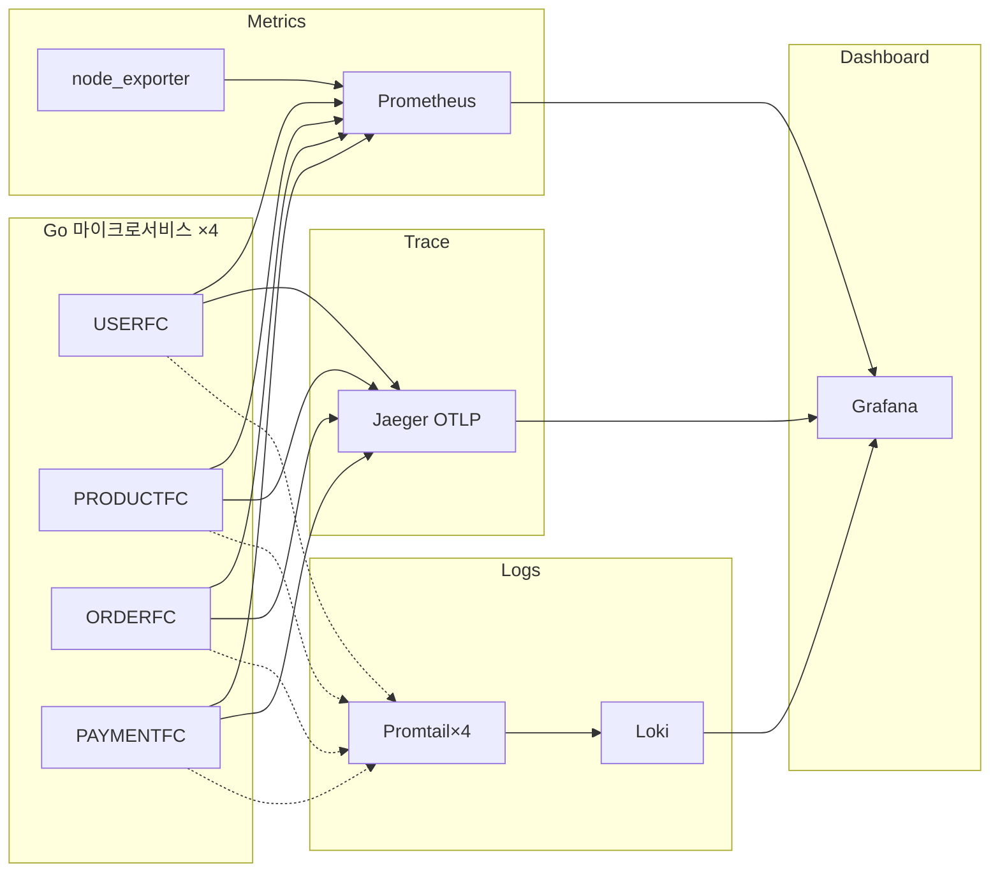
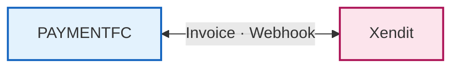

# Go Commerce — 시스템 아키텍처

구간별 색, 컴포넌트별 스택, 프로토콜 라벨, 관측성을 한 장에 읽히게 구성한 **레이어드 뷰** 아키텍처 문서입니다.

- **HTML 상세 다이어그램**: `docs/architecture.html` · 백업 `architecture-v1.html` · **메인 권장** `architecture-v2.html` (Edge에 **Project Q&A Assistant** — `tools/project-qa-assistant`, RAG·Chroma·FastAPI·React 반영)
- **다이어그램**: [Mermaid Live](https://mermaid.live)에서 PNG/SVG로 내보낼 수 있습니다.
- **한계**: Mermaid는 아이콘·AWS 심볼 수준의 그래픽은 아니므로, **최종 비주얼은 Live에서 SVG 내보낸 뒤 Figma에 로고·타이틀만 얹는 방식**이 가장 깔끔합니다.

---

## 0. 레이어 정의 (한눈에 보는 구조)

| 레이어 | 역할 | 이 레포에서의 구현 |
|--------|------|---------------------|
| **① Edge** | 사용자·API 진입 | 브라우저, (선택) API 클라이언트 |
| **② Presentation** | 정적 UI·리버스 프록시 | React/Vite → **Nginx** 컨테이너 **:3001** |
| **③ Application** | 도메인별 비즈니스 로직 | **USERFC / PRODUCTFC / ORDERFC / PAYMENTFC** (Go) |
| **④ Integration** | 비동기·이벤트·외부 연동 | **Kafka**(+Zookeeper), **Xendit**(REST·Webhook) |
| **⑤ Data** | 영속성·캐시·감사 | **PostgreSQL×4** (DB per service), **Redis**, **MongoDB** |
| **⑥ Platform** | 시크릿 | **Vault**(dev) |
| **⑦ Observability** | 메트릭·트레이스·로그·대시보드 | **Prometheus**, **Grafana**, **Loki+Promtail**, **Jaeger**, **node_exporter** |

---

## 1. 레이어드 아키텍처 (스택 · 프로토콜)

아래 노드에는 **런타임·프레임워크·주요 라이브러리**를 적어 두었습니다. (실제 `go.mod`·`docker-compose` 기준.)

```mermaid
%%{init: {'theme': 'base', 'themeVariables': { 'fontFamily': 'system-ui, Segoe UI, sans-serif', 'fontSize': '13px'}}}%%
flowchart TB
    subgraph L1["① Edge · 클라이언트"]
        direction LR
        BR["Browser / SPA"]
        API_CLI["API Clients"]
    end

    subgraph L2["② Presentation · 진입"]
        FE["Nginx + Frontend build<br/>React · Vite · :3001<br/>→ BFF 역할로 4 서비스로 프록시"]
    end

    subgraph L3["③ Application · 도메인 마이크로서비스 (Go)"]
        direction TB
        USER["USERFC<br/>────────<br/>Go · Gin · GORM<br/>JWT · Redis rate limit / blacklist<br/>REST :28080 · gRPC :50051<br/>Prometheus RED · OTLP → Jaeger"]
        PROD["PRODUCTFC<br/>────────<br/>Go · Gin · GORM<br/>Kafka consumer · Redis cache<br/>REST :28081<br/>Prometheus RED · OTLP → Jaeger"]
        ORD["ORDERFC<br/>────────<br/>Go · Gin · GORM<br/>Kafka pub/sub 주문·결제 이벤트<br/>REST :28082<br/>Prometheus RED · OTLP → Jaeger"]
        PAY["PAYMENTFC<br/>────────<br/>Go · Gin · GORM<br/>Xendit Invoice · Webhook<br/>Kafka · Mongo audit<br/>REST :28083<br/>Prometheus RED + domain metrics · OTLP → Jaeger"]
    end

    subgraph L4["④ Integration · 메시징 · 외부"]
        direction TB
        KFK["Apache Kafka + Zookeeper<br/>도메인 이벤트 (order / payment / stock 등)"]
        XENDIT["Xendit<br/>Invoice API · Webhook callback"]
    end

    subgraph L5["⑤ Data · DB per Service"]
        direction TB
        PGU[("PostgreSQL<br/>user DB · host :5433")]
        PGP[("PostgreSQL<br/>product DB · :5434")]
        PGO[("PostgreSQL<br/>order DB · :5435")]
        PGY[("PostgreSQL<br/>payment DB · :5436")]
        RDS[("Redis :6379<br/>세션·캐시·제한")]
        MGO[("MongoDB :27017<br/>감사·로그성 데이터")]
    end

    subgraph L6["⑥ Platform"]
        VAULT["HashiCorp Vault :8200<br/>(dev 모드 시크릿)"]
    end

    subgraph L7["⑦ Observability · 운영 플레인"]
        direction LR
        subgraph MET["Metrics & alerts"]
            PROM["Prometheus :9090<br/>scrape 4 FC + node_exporter<br/>recording / alerting rules"]
            NE["node_exporter :9100"]
        end
        subgraph TRACE["Tracing"]
            JGR["Jaeger :16686<br/>OTLP :4317 / :4318"]
        end
        subgraph LOG["Logs"]
            PT["Promtail ×4"]
            LOK["Loki :3100"]
        end
        subgraph VIZ["Dashboards"]
            GRA["Grafana :3002<br/>Prometheus + Loki DS"]
        end
    end

    BR --> FE
    API_CLI --> FE

    FE -->|"HTTP/JSON"| USER
    FE -->|"HTTP/JSON"| PROD
    FE -->|"HTTP/JSON"| ORD
    FE -->|"HTTP/JSON"| PAY

    USER --> PGU
    USER --> RDS
    PROD --> PGP
    PROD --> RDS
    ORD --> PGO
    ORD --> RDS
    PAY --> PGY
    PAY --> RDS
    PAY --> MGO

    ORD <-->|"Kafka protocol"| KFK
    PROD <-->|"Kafka protocol"| KFK
    PAY <-->|"Kafka protocol"| KFK

    PAY <-->|"HTTPS REST · Webhook"| XENDIT
    PAY -.->|"gRPC"| USER

    USER -.-> VAULT

    USER -->|"HTTP /metrics"| PROM
    PROD -->|"HTTP /metrics"| PROM
    ORD -->|"HTTP /metrics"| PROM
    PAY -->|"HTTP /metrics"| PROM
    NE --> PROM
    USER -->|"OTLP HTTP"| JGR
    PROD -->|"OTLP HTTP"| JGR
    ORD -->|"OTLP HTTP"| JGR
    PAY -->|"OTLP HTTP"| JGR
    USER -.->|"container logs"| PT
    PROD -.->|"container logs"| PT
    ORD -.->|"container logs"| PT
    PAY -.->|"container logs"| PT
    PT --> LOK
    PROM --> GRA
    LOK --> GRA
    JGR --> GRA

    classDef edge fill:#E0F2F1,stroke:#00695C,stroke-width:2px,color:#004D40
    classDef pres fill:#E8EAF6,stroke:#3949AB,stroke-width:2px,color:#1A237E
    classDef app fill:#E3F2FD,stroke:#1565C0,stroke-width:3px,color:#0D47A1
    classDef integ fill:#FFEBEE,stroke:#C62828,stroke-width:2px,color:#B71C1C
    classDef data fill:#E8F5E9,stroke:#2E7D32,stroke-width:2px,color:#1B5E20
    classDef plat fill:#F3E5F5,stroke:#6A1B9A,stroke-width:2px,color:#4A148C
    classDef obs fill:#FFF8E1,stroke:#F57F17,stroke-width:2px,color:#E65100
    classDef ext fill:#FCE4EC,stroke:#AD1457,stroke-width:2px,color:#880E4F

    class BR,API_CLI edge
    class FE pres
    class USER,PROD,ORD,PAY app
    class KFK integ
    class PGU,PGP,PGO,PGY,RDS,MGO data
    class VAULT plat
    class PROM,NE,JGR,PT,LOK,GRA obs
    class XENDIT ext
```

> **참고 (레퍼런스 다이어그램과의 대응)**  
> - **디바이스 레이어** → 여기서는 **Edge + Presentation** 으로 대응 (웹·API 클라이언트).  
> - **슈퍼바이저/엔진** → **Application** 의 4개 Go 서비스 + **Integration** 의 Kafka·결제.  
> - **서비스 레이어(버스)** → **Kafka** 가 도메인 간 이벤트 버스.  
> - **관측성** → 각 서비스에 **Prometheus RED** + **OTLP** 를 명시 (운영 관점 강조).

---

## 2. 컴포넌트 스펙 표

| 서비스 | 런타임 / 프레임워크 | 노출 | 주요 저장소 | 메시징 / 동기 연동 | 관측성 |
|--------|---------------------|------|-------------|---------------------|--------|
| **USERFC** | Go · Gin · GORM | REST **28080**, gRPC **50051** | PostgreSQL(user), Redis | gRPC 서버 제공, PAYMENTFC가 클라이언트 | `/metrics` RED, OTLP → Jaeger |
| **PRODUCTFC** | Go · Gin · GORM | REST **28081** (컨테이너 8081) | PostgreSQL(product), Redis | Kafka consume/produce | 동일 |
| **ORDERFC** | Go · Gin · GORM | REST **28082** (8083) | PostgreSQL(order), Redis | Kafka 주문·결제 이벤트 | 동일 |
| **PAYMENTFC** | Go · Gin · GORM | REST **28083** | PostgreSQL(payment), Redis, MongoDB | Kafka, **gRPC → USERFC**, **Xendit** | RED + 비즈니스 메트릭(웹훅 outcome 등) |

---

## 3. 프로토콜 · 포트 요약

| 경로 | 프로토콜 | 비고 |
|------|----------|------|
| Browser → Frontend | HTTP | Nginx **:3001** |
| Frontend → 각 FC | HTTP/JSON | REST |
| PAYMENTFC → USERFC | gRPC | 사용자 검증 등 |
| FC ↔ Kafka | Kafka 프로토콜 | 컨테이너 내부 `kafka:9092` |
| PAYMENTFC ↔ Xendit | HTTPS REST + Webhook | 시크릿은 env / Vault |
| FC → Jaeger | OTLP HTTP | `JAEGER_ENDPOINT` |
| Prometheus → FC | HTTP GET `/metrics` | 서비스별 포트는 compose·prometheus.yml 과 일치 |
| Promtail → Loki | HTTP | 로그 스트림 |

---

## 4. 관측 가능성만 분리한 그림

---

## 5. 외부 연동 (결제만)

---

## 6. 확장 메모

compose는 **단일 레플리카** 기준이며, 프로덕션에서는 **K8s·HPA·외부 관리 Kafka/DB** 로 치환합니다.

---

## PNG / SVG 내보내기

1. [mermaid.live](https://mermaid.live)에 **§1** 코드 블록을 붙여 넣습니다.  
2. **Actions → SVG/PNG** 로 저장합니다.  

