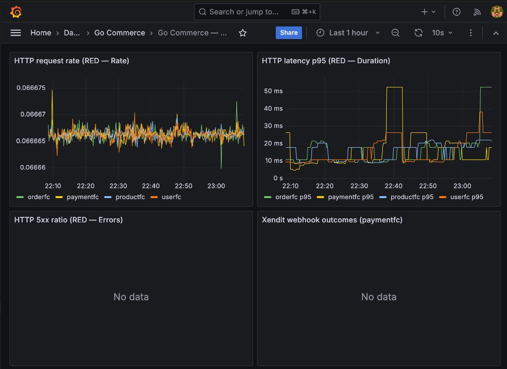

# Phase 5: Observability 완성

> RED 메트릭·비즈니스 메트릭·알림 규칙·Grafana as Code·분산 트레이싱 보강

---

## 개선 전 문제점

| 문제 | 설명 |
|------|------|
| 커스텀 메트릭 부재 | `/metrics`는 있으나 애플리케이션별 HTTP RED·도메인 카운터가 없음 |
| 대시보드 비어 있음 | Grafana는 띄워졌으나 레포에 프로비저닝·대시보드 JSON 없음 |
| 알림 없음 | 규칙 파일 없음 → Prometheus UI에서도 알림 상태 확인 어려움 |
| 트레이싱 공백 | HTTP 미들웨어 스팬만, Kafka 컨슈머·gRPC 클라이언트 스팬 없음 |

---

## 5-1. 커스텀 Prometheus 메트릭 (RED + 비즈니스)

### HTTP RED (4개 FC 공통)

각 서비스에 Gin 미들웨어 `PrometheusRED("<service>")` 를 등록한다.

| 메트릭 | 타입 | 라벨 | 설명 |
|--------|------|------|------|
| `commerce_http_requests_total` | Counter | `service`, `method`, `path`, `status` | 요청 수. `path`는 **Gin `FullPath()`** (라우트 템플릿)로 저카디널리티 유지 |
| `commerce_http_request_duration_seconds` | Histogram | `service`, `method`, `path` | 지연 시간(초) |

- **Rate**: `sum(rate(commerce_http_requests_total[5m])) by (service)`
- **Errors**: 5xx 비율 — `status=~"5.."` / 전체
- **Duration**: `histogram_quantile(0.95, sum by (service, le) (rate(commerce_http_request_duration_seconds_bucket[5m])))`

### 비즈니스 (PAYMENTFC)

| 메트릭 | 타입 | 라벨 | 설명 |
|--------|------|------|------|
| `commerce_payment_xendit_webhook_processed_total` | Counter | `outcome` | `success`, `invalid_token`, `bind_error`, `process_error` |

구현: `PAYMENTFC/infrastructure/metrics/business.go`, `HandleXenditWebhook`에서 라벨별 증가.

---

## 5-2. Grafana 대시보드 as Code

- **프로비저닝**: `grafana/provisioning/datasources/datasources.yaml` — Prometheus(`uid: prometheus`), Loki(`uid: loki`)
- **대시보드 프로바이더**: `grafana/provisioning/dashboards/dashboards.yaml` — `/var/lib/grafana/dashboards` 마운트
- **대시보드 JSON**: `grafana/dashboards/go-commerce-red.json`  
  - HTTP 요청률, p95 지연, 5xx 비율, Xendit webhook outcome 시계열

`docker-compose.yml`의 `grafana` 서비스에 위 디렉터리를 볼륨으로 마운트함.

> **참고**: 기존에 Grafana UI로 수동 등록한 데이터소스가 볼륨에 남아 있으면 이름이 겹칠 수 있다. 프로비저닝 데이터소스 UID(`prometheus`, `loki`)를 패널에서 사용한다.

### 대시보드 예시 (HTTP RED)

*요청률·p95는 트래픽이 있으면 채워진다. **HTTP 5xx ratio**는 5xx가 없으면 “No data”로 보일 수 있고, **Xendit webhook outcomes**는 웹훅이 한 번도 처리되지 않았으면 시계열이 없다.*

---

## 5-3. 알림 규칙 (Prometheus)

파일: `prometheus/alerts.yml` (컨테이너: `/etc/prometheus/alerts.yml`)

| 알림 | 조건(요지) |
|------|------------|
| `FCScrapeTargetDown` | `up{job=~"userfc|productfc|orderfc|paymentfc"} == 0` 2분 이상 |
| `HighHTTP5xxRate` | 서비스별 5xx 비율 > 5% (5분) |
| `XenditWebhookProcessErrors` | `process_error` outcome이 15분 창에서 5회 초과 |

`prometheus/prometheus.yml`에 `rule_files`로 연결됨.

> 이 스택에는 **Alertmanager**가 없다. 알림은 Prometheus **Alerts** 화면에서 확인하거나, 운영 시 Alertmanager·Slack 등을 추가로 연결하면 된다.

**Loki 기반 로그 알림**: Ruler 설정·Loki datasource를 Grafana Alerting에 연동하는 방식이 일반적이며, 본 레포 범위에서는 Prometheus 규칙으로 대체했다.

---

## 5-4. Kafka / gRPC 분산 트레이싱 보강

### Kafka (PRODUCTFC)

- `stock.updated` 컨슈머(`kafka/consumer/update_stock.go`): 메시지 처리 구간에 `kafka.consume.stock.updated` 스팬(Consumer kind), `messaging.system=kafka`, `order.id` 속성.
- 하위 호출(Idempotency, `UpdateProductStockByProductID`, DLQ)에 동일 trace context 전달.

### gRPC 클라이언트 (PAYMENTFC)

- `grpc/user_client.go`: `GetUserInfoByUserId`, `ValidateToken` 호출에 클라이언트 스팬(`grpc.UserService/...`).

서버 측 USERFC gRPC는 기존 인스트루먼테이션이 없으면 링크가 단방향으로 보일 수 있다. 필요 시 `grpc.NewClient`에 OTel stats handler 등을 추가해 확장 가능.

---

## 5-5. SLI / SLO · 에러 버짓 (개념 정리)

본 프로젝트는 학습용 단일 리전 스택이므로 **수치 SLO는 코드에 고정하지 않는다.** 면접·설계 답변용으로 아래처럼 정의할 수 있다.

| SLI | 예시 정의 | SLO(예) |
|-----|-----------|---------|
| 가용성 | HTTP 5xx 비율 < 0.1% (월간) | 99.9% |
| 지연 | API p95 < 500ms | 99% 요청 |
| 비즈니스 | Xendit webhook `process_error` 비율 | 월간 < 0.5% |

**에러 버짓**: 한 달 허용 다운타임 ≈ `(1 - SLO) × 해당 기간`. SLO를 초과하면 기능 프리즈·릴리즈 게이트 강화 등 정책을 둔다.

---

## 변경 파일 요약

| 영역 | 파일 |
|------|------|
| USERFC | `middleware/prometheus_red.go`, `main.go` |
| PRODUCTFC | `middleware/prometheus_red.go`, `main.go`, `tracing/tracing.go` (`StartSpan`), `kafka/consumer/update_stock.go` |
| ORDERFC | `middleware/prometheus_red.go`, `main.go` |
| PAYMENTFC | `middleware/prometheus_red.go`, `main.go`, `infrastructure/metrics/business.go`, `cmd/payment/handler/handler.go`, `grpc/user_client.go`, `go.sum` / `vendor` (갱신) |
| 루트 | `prometheus/alerts.yml`, `prometheus/prometheus.yml`, `docker-compose.yml`, `grafana/provisioning/*`, `grafana/dashboards/go-commerce-red.json` |

---

## 확인 방법

1. `docker compose up -d --build` 후 FC 기동  
2. `curl`로 각 서비스에 요청 → `http://localhost:28080/metrics` 등에서 `commerce_http_` 메트릭 확인  
3. Prometheus: http://localhost:9090 → **Alerts**  
4. Grafana: http://localhost:3002 → 폴더 **Go Commerce** → **Go Commerce — HTTP RED**

---

## 면접 포인트

1. **왜 path에 FullPath?** — 동적 ID가 들어가는 URL을 그대로 라벨로 쓰면 카디널리티 폭발로 Prometheus가 비대해진다.  
2. **RED와 USE** — USE는 자원(CPU·메모리) 중심, RED는 요청 기반 마이크로서비스에 잘 맞는다.  
3. **알림 피로** — 비율·최소 트래픽·`for` 구간으로 오탐을 줄인다.
